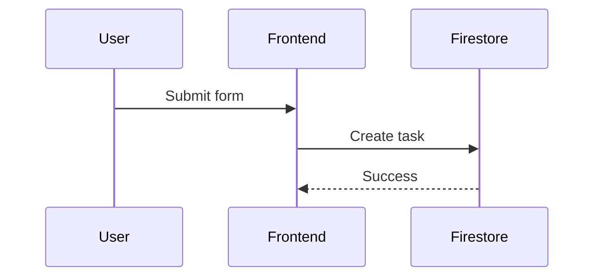

# 📊 WiseCat Diagrams - Visual Index

Quick reference to all Mermaid diagrams in the knowledge base.

## 🎯 How to View Diagrams

### Option 1: VS Code (Recommended)
1. Install extension: "Markdown Preview Mermaid Support"
2. Open any `.md` file with diagrams
3. Press `Cmd+Shift+V` (Mac) or `Ctrl+Shift+V` (Windows)

### Option 2: Mermaid Live Editor
1. Copy diagram code (between ` ```mermaid` and ` ``` `)
2. Go to https://mermaid.live
3. Paste and view

### Option 3: GitHub
- Push to GitHub and view `.md` files directly (GitHub renders Mermaid)

---

## 📚 Available Diagrams by Module

### User Management Module
**File**: [`knowledge/modules/user-management.md`](file:///Users/yi-hsuanlee/Desktop/yihsuanlee.github.io/knowledge/modules/user-management.md)

**Diagrams**:
1. **Authentication Flow** (Sequence Diagram)
   - Shows: Login → Auth Check → Dashboard redirect
   - Shows: Session timeout monitoring
   - Lines: ~30

### Task System Module
**File**: [`knowledge/modules/task-system.md`](file:///Users/yi-hsuanlee/Desktop/yihsuanlee.github.io/knowledge/modules/task-system.md)

**Diagrams**:
1. **Task Creation to AI Call** (Sequence Diagram)
   - Shows: User submit → Firestore → Cloud Function → N8N → Vapi → External service
   - Shows: Retry logic on failure
   - Lines: ~50

2. **SMS Webhook Flow** (Sequence Diagram)
   - Shows: Twilio → Cloud Function → Firestore → User Dashboard
   - Shows: Inbound message handling
   - Lines: ~15

### Payment System Module
**File**: [`knowledge/modules/payment-system.md`](file:///Users/yi-hsuanlee/Desktop/yihsuanlee.github.io/knowledge/modules/payment-system.md)

**Diagrams**:
1. **Credit Check & Deduction** (Sequence Diagram)
   - Shows: Service request → Credit check → Task creation → Deduction
   - Lines: ~25

2. **Phone Number Purchase Flow** (Sequence Diagram)
   - Shows: Transaction → Credit deduction → Twilio purchase
   - Shows: Rollback on failure
   - Lines: ~30

3. **Service Usage Flow** (Sequence Diagram)
   - Shows: N8N → Vapi → Twilio → Cost calculation → Credit deduction
   - Lines: ~25

---

## 🎨 Comprehensive Diagrams Collection

**File**: Check Gemini Artifacts for `component_analysis.md`

**Contains 10 Diagrams**:
1. High-Level System Architecture
2. User Authentication Flow
3. Mouthpiece Service Component Breakdown
4. Data Flow: Task Creation to AI Call
5. Database Schema (ERD)
6. Frontend Component Hierarchy
7. Cloud Functions Architecture
8. Security & Validation Flow
9. Internationalization (i18n) System
10. Deployment Pipeline

---

## 🔍 Quick Diagram Finder

### By Topic

| What You Want to Understand | Go To |
|----------------------------|-------|
| How login works | `user-management.md` → Authentication Flow |
| How tasks are processed | `task-system.md` → Task Creation Flow |
| How SMS messages arrive | `task-system.md` → SMS Webhook Flow |
| How credits are deducted | `payment-system.md` → Credit Deduction Flow |
| How phone numbers are purchased | `payment-system.md` → Phone Purchase Flow |
| Overall system architecture | Artifacts → `component_analysis.md` → Diagram 1 |
| Database structure | Artifacts → `component_analysis.md` → Diagram 5 |
| Frontend components | Artifacts → `component_analysis.md` → Diagram 6 |
| Cloud Functions | Artifacts → `component_analysis.md` → Diagram 7 |
| Deployment process | Artifacts → `component_analysis.md` → Diagram 10 |

### By Diagram Type

| Type | Location | Count |
|------|----------|-------|
| Sequence Diagrams | Module docs | 6 |
| Architecture Diagrams | Artifacts | 4 |
| ERD (Database) | Artifacts | 1 |
| Flowcharts | Artifacts | 3 |

---

## 📝 Example: Viewing a Diagram

### Step-by-Step

1. **Open the file**:
   ```bash
   code knowledge/modules/task-system.md
   ```

2. **Find the diagram section** (search for ` ```mermaid`)

3. **View it**:
   - **In VS Code**: Press `Cmd+Shift+V` to preview
   - **In Browser**: Copy code → paste at https://mermaid.live

### Example Diagram Code

Here's what a Mermaid diagram looks like in the files:

````markdown

````

---

## 🎯 Next Steps

1. **View existing diagrams**:
   - Open any module `.md` file
   - Use VS Code preview or Mermaid Live

2. **Create new diagrams**:
   - Add to existing module docs
   - Or create standalone `.mmd` files in `knowledge/diagrams/`

3. **Update diagrams**:
   - Edit the Mermaid code directly
   - Preview to verify changes

---

**Pro Tip**: Install "Markdown Preview Mermaid Support" in VS Code for the best viewing experience!
