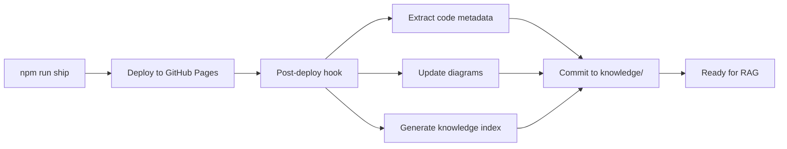
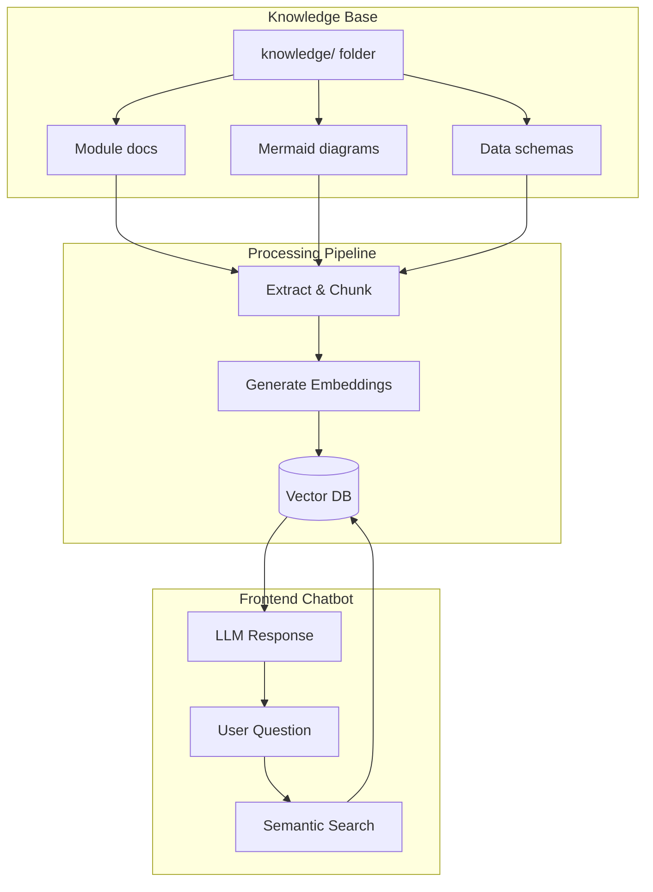

# WiseCat Knowledge Base

> **Purpose**: This directory contains structured documentation, diagrams, and schemas for the WiseCat platform. It serves as the foundation for future RAG (Retrieval-Augmented Generation) chatbot integration.

## 📁 Directory Structure

```
knowledge/
├── modules/           # Module-based documentation (user, payment, tasks, etc.)
├── diagrams/          # Mermaid diagrams organized by feature
├── schemas/           # Data schemas and database structures
├── api-contracts/     # API endpoint documentation and contracts
└── README.md         # This file
```

## 🎯 Purpose & Vision

### Current Use
- **Developer Reference**: Quick lookup for system architecture
- **Onboarding**: New team members understand the system
- **Documentation**: Single source of truth for all components

### Future Use (RAG Chatbot)
- **Automated Q&A**: Frontend chatbot answers user questions
- **Context-Aware Help**: Provide relevant documentation based on user's current page
- **Code Understanding**: AI assistant helps developers navigate codebase

## 📚 Knowledge Organization

### By Module
Each module represents a major functional area:
- `user-management.md` - Authentication, profiles, sessions
- `payment-system.md` - Credits, transactions, billing
- `task-system.md` - Task lifecycle, queue, retry logic
- `phone-numbers.md` - Twilio integration, number management
- `ai-services.md` - Vapi integration, call handling
- `frontend-components.md` - UI components, forms, validation

### By Feature
Each feature has:
1. **Overview** - What it does
2. **Data Flow** - How data moves through the system
3. **Mermaid Diagram** - Visual representation
4. **API Contracts** - Request/response formats
5. **Database Schema** - Firestore structure
6. **Code Locations** - Where to find the implementation

## 🔄 Auto-Update Strategy

### Deployment Hook
After each `npm run ship`, the system will:

1. **Extract Metadata** - Parse TypeScript/JavaScript files
2. **Update Diagrams** - Regenerate Mermaid diagrams from code
3. **Generate Index** - Create searchable knowledge index
4. **Prepare for RAG** - Format for vector embedding

### Implementation Plan



## 🤖 Future RAG Integration

### Architecture



### Technology Stack (Proposed)
- **Vector Database**: Pinecone / Supabase Vector / Firebase Extensions
- **Embeddings**: OpenAI `text-embedding-3-small`
- **LLM**: GPT-4 or Claude (via API)
- **Frontend**: Chat widget in dashboard

## 📝 Contributing to Knowledge Base

### Adding New Module Documentation

1. Create file in `knowledge/modules/[module-name].md`
2. Follow the template structure
3. Include Mermaid diagrams
4. Link to relevant code files
5. Document API contracts

### Updating Diagrams

1. Edit `.mmd` files in `knowledge/diagrams/`
2. Use Mermaid Live Editor for preview: https://mermaid.live
3. Keep diagrams focused (one concept per diagram)
4. Use consistent styling

## 🔗 Quick Links

- [Module Index](./modules/README.md)
- [Diagram Gallery](./diagrams/README.md)
- [API Documentation](./api-contracts/README.md)
- [Database Schemas](./schemas/README.md)

## 🚀 Next Steps

- [ ] Phase 1: Create module-based documentation ✅ (In Progress)
- [ ] Phase 2: Implement post-deploy automation
- [ ] Phase 3: Set up vector database
- [ ] Phase 4: Build frontend chatbot
- [ ] Phase 5: Integrate with dashboard

---

**Last Updated**: 2026-01-19  
**Maintained By**: WiseCat Development Team
