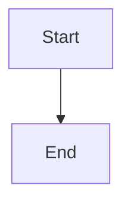
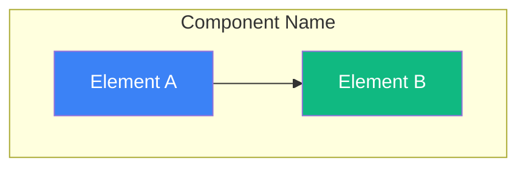

# Diagram Gallery

This directory contains Mermaid diagrams organized by feature and system component.

## 📊 Available Diagrams

### System Architecture

- **[system-overview.mmd](./system-overview.mmd)** - High-level architecture
- **[deployment-pipeline.mmd](./deployment-pipeline.mmd)** - Build and deploy flow
- **[database-schema.mmd](./database-schema.mmd)** - Firestore collections

### User Flows

- **[authentication-flow.mmd](./authentication-flow.mmd)** - Login and session management
- **[task-creation-flow.mmd](./task-creation-flow.mmd)** - Task lifecycle
- **[credit-deduction-flow.mmd](./credit-deduction-flow.mmd)** - Payment processing

### Feature Diagrams

- **[sms-webhook-flow.mmd](./sms-webhook-flow.mmd)** - Inbound SMS handling
- **[task-priority-queue.mmd](./task-priority-queue.mmd)** - Priority dispatcher
- **[phone-purchase-flow.mmd](./phone-purchase-flow.mmd)** - Number acquisition
- **[n8n-integration.mmd](./n8n-integration.mmd)** - Webhook integration

## 🎨 Viewing Diagrams

### Option 1: Mermaid Live Editor
1. Copy diagram content
2. Visit https://mermaid.live
3. Paste and view

### Option 2: VS Code Extension
1. Install "Markdown Preview Mermaid Support"
2. Open any `.mmd` file
3. Press `Cmd+Shift+V` (Mac) or `Ctrl+Shift+V` (Windows)

### Option 3: Embed in Markdown
```markdown

```

## 📝 Creating New Diagrams

### Template



### Best Practices

1. **Keep it focused** - One concept per diagram
2. **Use colors** - Highlight important nodes
3. **Add notes** - Use `Note over` for context
4. **Group related items** - Use `subgraph`
5. **Consistent styling** - Use project color palette

### Color Palette

```
Primary Blue:   #3b82f6
Success Green:  #10b981
Warning Orange: #f59e0b
Error Red:      #ef4444
Purple:         #6366f1
Dark:           #1a1a1a
```

## 🔄 Auto-Generated Diagrams (Future)

After Phase 2 automation is complete, some diagrams will be auto-generated:

- Code dependency graphs
- Database relationship diagrams
- API endpoint maps

Manual diagrams will remain for:
- User flows
- Business logic
- System architecture
