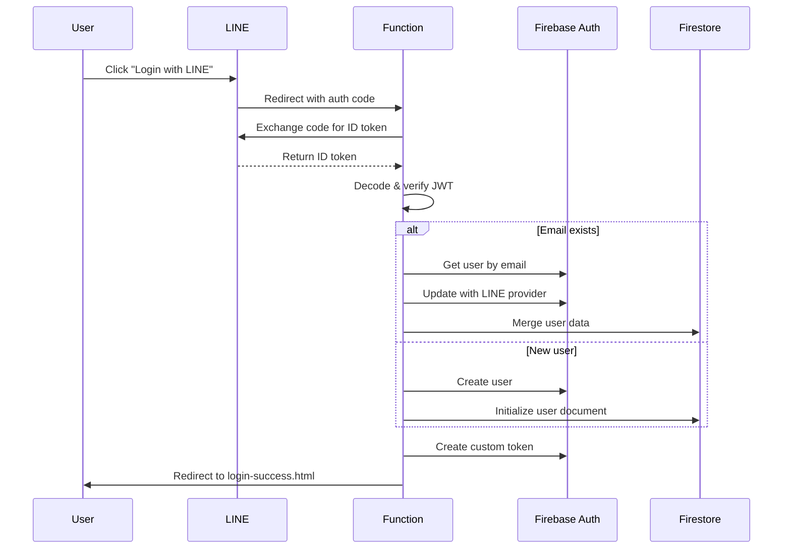
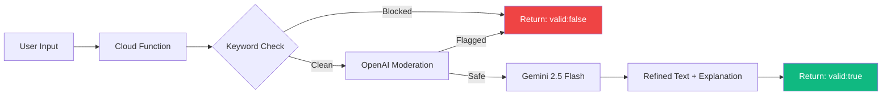
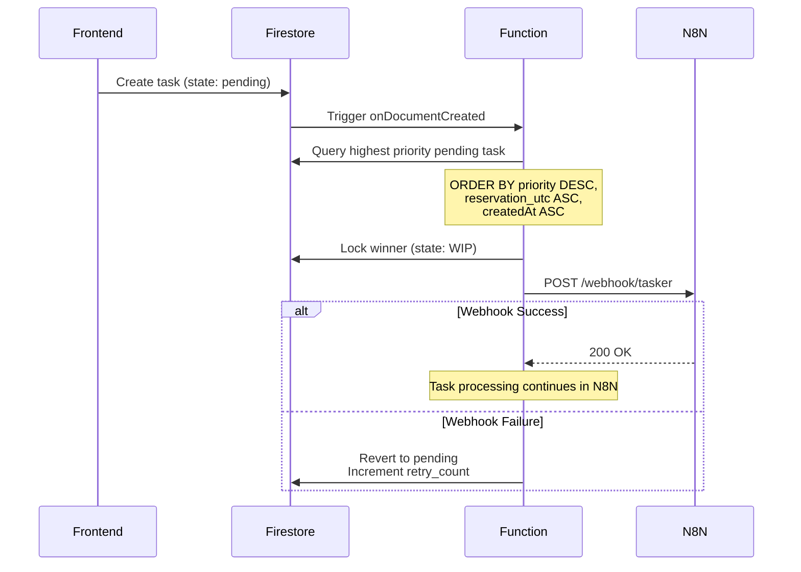
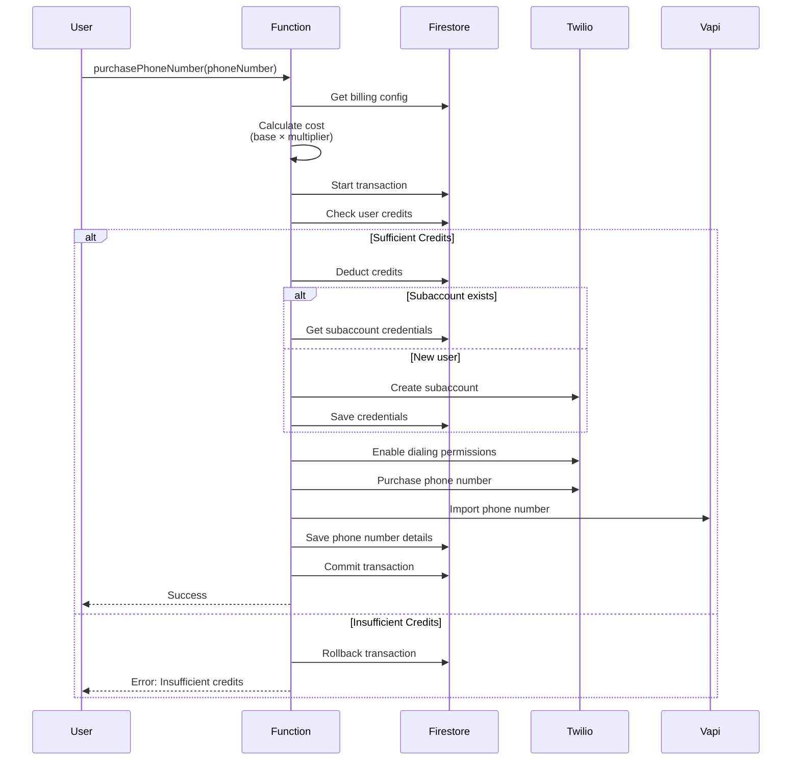

# Cloud Functions Module

## Overview

WiseCat uses **Firebase Cloud Functions (v2)** for backend logic. All functions are deployed to Google Cloud and handle authentication, task management, Twilio integration, and security validation.

**Project**: `wise-catty-cc`  
**Runtime**: Node.js 20  
**Database**: Firestore (`reservation` database)

## Architecture

```mermaid
graph TB
    subgraph "Frontend"
        User[User Actions]
    end
    
    subgraph "Cloud Functions"
        Auth[lineCallback<br/>LINE OAuth]
        Validation[validateMissionV2<br/>Security + AI Refinement]
        Dispatcher[triggerN8nWebhook<br/>Priority Queue]
        Phone[Phone Number Functions<br/>Search/Purchase/Release]
        Rates[getCallRates<br/>Pricing Info]
        Usage[getTransformedUsageHistory<br/>Billing Data]
    end
    
    subgraph "External Services"
        LINE[LINE Login API]
        Gemini[Gemini 2.5 Flash<br/>Refinement]
        OpenAI[OpenAI Moderation<br/>Safety Check]
        N8N[N8N Workflows]
        Twilio[Twilio API]
    end
    
    subgraph "Database"
        Firestore[(Firestore<br/>reservation DB)]
    end
    
    User --> Auth
    User --> Validation
    User --> Phone
    User --> Rates
    User --> Usage
    
    Auth --> LINE
    Validation --> Gemini
    Validation --> OpenAI
    Dispatcher --> N8N
    Phone --> Twilio
    Rates --> Twilio
    Usage --> Twilio
    
    Firestore -.Trigger.-> Dispatcher
    
    Auth --> Firestore
    Phone --> Firestore
    
    style Dispatcher fill:#f59e0b,color:#fff
    style Validation fill:#ef4444,color:#fff
    style Phone fill:#10b981,color:#fff
```


## Cloud Functions List

### Authentication Functions

#### 1. **lineCallback** 🔐

**Type**: `onRequest` (HTTP endpoint)  
**URL**: `https://wise-catty.cc/api/auth/line/callback`  
**Purpose**: Handles LINE Login OAuth callback

**Flow**:


**Request**:
```
GET /api/auth/line/callback?code=ABC123XYZ&state=...
```

**Response**:
```
HTTP 302 Redirect
Location: https://wise-catty.cc/login-success.html?token=CUSTOM_TOKEN
```

**Key Features**:
- **Anti-duplicate**: Prevents race conditions with code deduplication
- **Account merging**: Links LINE account to existing email
- **Strict encoding**: Proper URL encoding for OAuth params
- **Error handling**: Graceful fallback on failures

**Secrets Used**:
- `LINE_CHANNEL_ID`
- `LINE_CHANNEL_SECRET`

---

### Security Functions

#### 2. **validateMissionV2** ✨ (Consolidated)

**Type**: `onCall` (callable function)  
**Purpose**: Unified security validation and AI refinement for mission descriptions/scripts.

**Flow**:


**Merged Logic**:
Previously, `checkMessageSafety` and `validateMissionDescription` were separate calls. To reduce latency and cost, they have been merged into this v2 function.

**Secret Used**:
- `GEMINI_API_KEY`
- `OPENAI_API_KEY`

**Request Parameters**:
- `missionId`: string
- `missionName`: string
- `description`: string
- `language`: string (en, zh, jp, kr, es, it)

**Response**:
```json
{
  "valid": true,
  "refinedText": "Professional version of input",
  "explanation": "Brief reasoning for changes"
}
```


---

### Task Management Functions

#### 3. **triggerN8nWebhook** ⚡

**Type**: `onDocumentCreated` (Firestore trigger)  
**Trigger**: New document in `tasks` collection  
**Database**: `reservation`  
**Purpose**: Priority queue dispatcher for task processing

**Flow**:


**Priority Logic**:
```javascript
// Query for highest priority task
tasksRef
  .where('state', '==', 'pending')
  .orderBy('priority', 'desc')       // 5 (highest) -> 1 (lowest)
  .orderBy('reservation_utc', 'asc') // Earliest first
  .orderBy('createdAt', 'asc')       // Tie-breaker
  .limit(1)
```

**Webhook Payload**:
```json
{
  "taskId": "abc123xyz",
  "type": "mouthpiece",
  "state": "WIP",
  "priority": 3,
  "retry_count": 1,
  "userId": "uid_abc123",
  "payload": { /* service-specific data */ },
  "createdAt": "2026-01-19T08:00:00Z"
}
```

**Retry Logic**:
- Backfills `retry_count` if missing (for old tasks)
- On webhook failure: reverts to `pending` and increments `retry_count`
- Future enhancement: exponential backoff

**Required Firestore Index**:
```json
{
  "collectionGroup": "tasks",
  "queryScope": "COLLECTION",
  "fields": [
    { "fieldPath": "state", "order": "ASCENDING" },
    { "fieldPath": "priority", "order": "DESCENDING" },
    { "fieldPath": "reservation_utc", "order": "ASCENDING" },
    { "fieldPath": "createdAt", "order": "ASCENDING" }
  ]
}
```

---

### Phone Number Management Functions

#### 4. **searchNumbers** 🔍

**Type**: `onCall`  
**Purpose**: Search available Twilio phone numbers by country

**Request**:
```typescript
const searchNumbers = httpsCallable(functions, 'searchNumbers');
const result = await searchNumbers({ 
  country: 'US',
  areaCode: '415'  // Optional
});
```

**Response**:
```typescript
{
  numbers: [
    {
      phoneNumber: '+14155551234',
      friendlyName: 'San Francisco, CA',
      locality: 'San Francisco',
      region: 'CA',
      capabilities: {
        voice: true,
        sms: true,
        mms: false
      },
      addressRequirements: 'none'
    }
  ]
}
```

**Filtering**:
- Excludes numbers requiring 'local' address (complex compliance)
- Limits to 20 results
- Filters by area code if provided

**Secrets Used**:
- `TWILIO_ACCOUNT_SID`
- `TWILIO_AUTH_TOKEN`

---

#### 5. **purchasePhoneNumber** 💳

**Type**: `onCall`  
**Purpose**: Purchase Twilio number and import to Vapi.ai

**Flow**:


**Request**:
```typescript
const purchase = httpsCallable(functions, 'purchasePhoneNumber');
const result = await purchase({ 
  phoneNumber: '+14155551234'
});
```

**Response**:
```typescript
{
  success: true,
  phoneNumber: '+14155551234',
  vapiPhoneNumberId: 'vapi-123',
  cost: 2.30,  // User cost (base × multiplier)
  capabilities: {
    voice: true,
    sms: true
  }
}
```

**Cost Calculation**:
```javascript
// Get base price from Twilio
const basePrice = 1.15;  // USD

// Get multiplier from Firestore config
const billing = await db.doc('configuration/settings').get();
const multiplier = billing.data().billing.number_multiplier || 2.0;

// Calculate user price
const userPrice = basePrice * multiplier;  // $2.30
```

**Subaccount Management**:
- Creates Twilio subaccount per user (first purchase)
- Stores credentials in Firestore: `users/{uid}/settings/settings`
- Reuses subaccount for subsequent purchases

**Vapi Integration**:
```javascript
// Import to Vapi.ai
await axios.post('https://api.vapi.ai/phone-number', {
  provider: 'twilio',
  number: phoneNumber,
  twilioAccountSid: subaccountSid,
  twilioAuthToken: subaccountAuthToken
});
```

**Secrets Used**:
- `TWILIO_ACCOUNT_SID`
- `TWILIO_AUTH_TOKEN`
- `VAPI_API_KEY`

---

#### 6. **releasePhoneNumber** 🗑️

**Type**: `onCall`  
**Purpose**: Release Twilio number and remove from Vapi.ai

**Request**:
```typescript
const release = httpsCallable(functions, 'releasePhoneNumber');
const result = await release({});  // Uses user's stored number
```

**Response**:
```typescript
{
  success: true,
  message: 'Phone number released successfully'
}
```

**Flow**:
1. Get user's phone number from Firestore
2. Delete from Vapi.ai
3. Release from Twilio
4. Clear from Firestore

**Secrets Used**:
- `TWILIO_ACCOUNT_SID`
- `TWILIO_AUTH_TOKEN`
- `VAPI_API_KEY`

---

### Billing & Usage Functions

#### 7. **getCallRates** 💰

**Type**: `onCall`  
**Purpose**: Get call rates with markup for a country

**Request**:
```typescript
const getRates = httpsCallable(functions, 'getCallRates');
const result = await getRates({ country: 'US' });
```

**Response**:
```typescript
{
  country: 'US',
  currency: 'USD',
  multiplier: 3.0,
  outbound: [
    {
      prefix: '+1',
      base_price: 0.013,      // Twilio cost
      user_price: 0.039,      // base × multiplier
      friendly_name: 'United States'
    }
  ],
  inbound: [
    {
      type: 'local',
      base_price: 0.0085,
      user_price: 0.0255,
      description: 'Per minute cost to receive'
    }
  ]
}
```

**Multiplier Logic**:
```javascript
// Get from Firestore config
const billing = await db.doc('configuration/settings').get();
const config = billing.data().billing;

// Country-specific or default
const multiplier = config.country_multipliers[country] 
                || config.common_multiplier 
                || 3.0;
```

**Secrets Used**:
- `TWILIO_ACCOUNT_SID`
- `TWILIO_AUTH_TOKEN`

---

#### 8. **getTransformedUsageHistory** 📊

**Type**: `onCall`  
**Purpose**: Get Twilio usage with markup applied

**Request**:
```typescript
const getUsage = httpsCallable(functions, 'getTransformedUsageHistory');
const result = await getUsage({});
```

**Response**:
```typescript
{
  usage: [
    {
      category: 'calls',
      description: 'Outbound calls',
      usage: 15.5,              // minutes
      unit: 'minutes',
      base_price: 0.65,         // Twilio cost
      user_price: 1.95,         // base × multiplier
      currency: 'USD',
      start_date: '2026-01-18T00:00:00Z',
      end_date: '2026-01-19T00:00:00Z'
    },
    {
      category: 'sms',
      description: 'SMS messages',
      usage: 10,
      unit: 'messages',
      base_price: 0.08,
      user_price: 0.24,
      currency: 'USD',
      start_date: '2026-01-18T00:00:00Z',
      end_date: '2026-01-19T00:00:00Z'
    }
  ],
  multiplier: 3.0
}
```

**Data Source**:
- Fetches from user's Twilio subaccount
- Last 30 days of usage
- Groups by category (calls, SMS, etc.)

**Secrets Used**:
- `TWILIO_ACCOUNT_SID`
- `TWILIO_AUTH_TOKEN`

---

## Configuration

### Secrets Management

**Set secrets**:
```bash
firebase functions:secrets:set LINE_CHANNEL_ID
firebase functions:secrets:set LINE_CHANNEL_SECRET
firebase functions:secrets:set OPENAI_API_KEY
firebase functions:secrets:set TWILIO_ACCOUNT_SID
firebase functions:secrets:set TWILIO_AUTH_TOKEN
firebase functions:secrets:set VAPI_API_KEY
```

**Access in code**:
```javascript
const { defineSecret } = require('firebase-functions/params');
const OPENAI_API_KEY = defineSecret("OPENAI_API_KEY");

exports.myFunction = onCall({ secrets: [OPENAI_API_KEY] }, async (request) => {
  const apiKey = OPENAI_API_KEY.value();
  // Use apiKey...
});
```

### Firestore Database

**Database**: `reservation` (not default)

**Access pattern**:
```javascript
const { getFirestore } = require('firebase-admin/firestore');
const db = getFirestore(admin.app(), 'reservation');
```

### Environment Variables

```bash
# Automatically set by Firebase
GCLOUD_PROJECT=wise-catty-cc
FUNCTION_REGION=us-central1
```

## Deployment

### Deploy All Functions

```bash
firebase deploy --only functions
```

### Deploy Specific Function

```bash
firebase deploy --only functions:triggerN8nWebhook
```

### View Logs

```bash
firebase functions:log
```

### Monitor in Console

https://console.firebase.google.com/project/wise-catty-cc/functions

## Common Patterns

### Pattern 1: Authenticated Callable Function

```javascript
exports.myFunction = onCall(async (request) => {
  // Check authentication
  if (!request.auth) {
    throw new HttpsError('unauthenticated', 'User must be logged in');
  }
  
  const uid = request.auth.uid;
  const { param1, param2 } = request.data;
  
  // Validate input
  if (!param1) {
    throw new HttpsError('invalid-argument', 'param1 is required');
  }
  
  // Do work...
  
  return { result: 'success' };
});
```

### Pattern 2: Firestore Transaction

```javascript
const db = getFirestore(admin.app(), 'reservation');
const userRef = db.doc(`users/uid_${userId}`);

await db.runTransaction(async (transaction) => {
  const userDoc = await transaction.get(userRef);
  const currentCredits = userDoc.data().credits || 0;
  
  if (currentCredits < cost) {
    throw new Error('Insufficient credits');
  }
  
  const newBalance = currentCredits - cost;
  transaction.update(userRef, { credits: newBalance });
});
```

### Pattern 3: External API Call with Error Handling

```javascript
try {
  const response = await axios.post('https://api.example.com/endpoint', {
    data: payload
  }, {
    headers: {
      'Authorization': `Bearer ${API_KEY.value()}`,
      'Content-Type': 'application/json'
    },
    timeout: 10000  // 10 second timeout
  });
  
  return response.data;
} catch (error) {
  console.error('API Error:', error.response?.data || error.message);
  throw new HttpsError('internal', 'External API failed');
}
```

## Performance Optimization

### Cold Start Mitigation

- Use **Cloud Functions v2** (faster cold starts)
- Keep dependencies minimal
- Use lazy loading for heavy imports

### Timeout Configuration

```javascript
exports.myFunction = onCall(
  { 
    timeoutSeconds: 60,  // Default: 60s, Max: 540s
    memory: '256MB'      // Default: 256MB
  },
  async (request) => {
    // Function logic
  }
);
```

### Concurrent Execution

```javascript
// Process multiple items in parallel
const results = await Promise.all(
  items.map(item => processItem(item))
);
```

## Error Handling Best Practices

### 1. Use HttpsError for Callable Functions

```javascript
throw new HttpsError('invalid-argument', 'Phone number is required');
// Error codes: invalid-argument, unauthenticated, permission-denied, 
//              not-found, already-exists, resource-exhausted, internal
```

### 2. Log Errors with Context

```javascript
console.error('[FunctionName] Error:', {
  userId: uid,
  operation: 'purchase',
  error: error.message
});
```

### 3. Fail Gracefully

```javascript
try {
  // Risky operation
} catch (error) {
  console.error('Non-critical error:', error);
  // Continue with degraded functionality
  return { success: true, warning: 'Partial failure' };
}
```

## Testing

### Local Emulator

```bash
firebase emulators:start --only functions,firestore
```

### Call Function Locally

```javascript
// In frontend code, point to emulator
connectFunctionsEmulator(functions, 'localhost', 5001);

// Then call normally
const result = await httpsCallable(functions, 'myFunction')({ data });
```

### Unit Tests

```javascript
const test = require('firebase-functions-test')();
const myFunctions = require('../index');

describe('checkMessageSafety', () => {
  it('blocks scam keywords', async () => {
    const result = await myFunctions.checkMessageSafety({ 
      data: { text: 'Get rich quick with crypto!' }
    });
    expect(result.status).toBe('blocked');
  });
});
```

## Related Modules

- [**Task System**](./task-system.md) - `triggerN8nWebhook` integration
- [**Payment System**](./payment-system.md) - Billing and credit deduction
- [**User Management**](./user-management.md) - Authentication flow
- [**N8N Workflows**](./n8n-workflows.md) - Webhook integration

## Future Enhancements

- [ ] Add rate limiting per user
- [ ] Implement exponential backoff for N8N retries
- [ ] Add Cloud Scheduler for periodic tasks
- [ ] Implement webhook signature verification
- [ ] Add detailed analytics/monitoring
- [ ] Implement circuit breaker pattern for external APIs

---

**Related Files**:
- [`functions/index.js`](file:///Users/yi-hsuanlee/Desktop/yihsuanlee.github.io/functions/index.js) - All Cloud Functions
- [`functions/package.json`](file:///Users/yi-hsuanlee/Desktop/yihsuanlee.github.io/functions/package.json) - Dependencies

**Last Updated**: 2026-01-19 (Extracted from source code)
