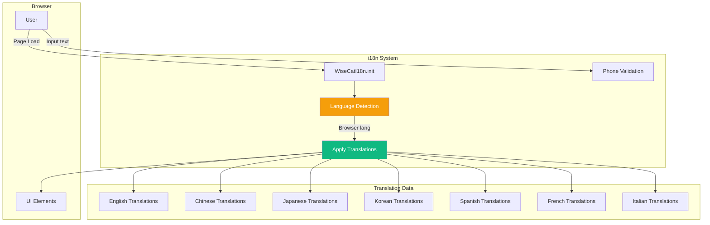

# Internationalization (i18n) System Module

## Overview

WiseCat supports **8 languages** with automatic language detection and dynamic UI translation. The i18n system handles all text content, date/time formatting, phone validation, and language-specific features.

**Supported Languages**: English, Chinese (Traditional), Japanese, Korean, Spanish, French, Italian

## Architecture



## Key Features

- 🌍 **8 Language Support** - EN, ZH, JP, KR, ES, FR, IT
- 🔍 **Auto-Detection** - Detects language from browser and text content
- 📱 **Phone Validation** - Country-specific regex patterns
- 🎨 **Dynamic UI** - Updates all elements with `data-i18n` attribute
- 🔄 **Language Switching** - User can manually change language
- 📝 **Script Language Detection** - Analyzes AI scripts for language

## Implementation

### File Structure

```
src/
├── i18n.ts                 # Main i18n system (1006 lines)
└── entry.ts                # Initializes i18n on page load
```

### Initialization

**In `entry.ts`**:
```typescript
import { WiseCatI18n } from './i18n';

// Initialize i18n system
WiseCatI18n.init();
```

**What `init()` does**:
1. Detects browser language
2. Loads translations
3. Applies to all `data-i18n` elements
4. Sets up language switcher (if present)

### Translation System

#### Translation Keys

**File**: `src/i18n.ts`

**Structure**:
```typescript
interface TranslationDict {
    [key: string]: any;
}

const WiseCatI18n = {
    translations: {
        en: { /* English translations */ },
        zh: { /* Chinese translations */ },
        jp: { /* Japanese translations */ },
        kr: { /* Korean translations */ },
        es: { /* Spanish translations */ },
        fr: { /* French translations */ },
        it: { /* Italian translations */ }
    }
};
```

#### Example Translations

**Portal Page**:
```typescript
{
    en: {
        portal_title: "WiseCat Portal",
        portal_subtitle: "Your Personal AI Assistant Hub",
        btn_google: "Sign in with Google",
        btn_line: "Sign in with LINE"
    },
    zh: {
        portal_title: "WiseCat 門戶",
        portal_subtitle: "您的個人 AI 助手中心",
        btn_google: "使用 Google 帳號登入",
        btn_line: "使用 LINE 帳號登入"
    },
    jp: {
        portal_title: "WiseCat ポータル",
        portal_subtitle: "あなたのパーソナルAIアシスタントハブ",
        btn_google: "Googleでログイン",
        btn_line: "LINEでログイン"
    }
}
```

**Service Pages**:
```typescript
{
    en: {
        service_mouthpiece_title: "Mouthpiece Service",
        service_mouthpiece_desc: "AI Voice representation service (Beta)",
        service_trial_title: "Free Trial Call",
        service_res_title: "Restaurant Reservation"
    },
    zh: {
        service_mouthpiece_title: "AI 傳聲筒",
        service_mouthpiece_desc: "AI 語音代表服務 (Beta)",
        service_trial_title: "免費試用撥號",
        service_res_title: "餐廳代訂"
    }
}
```

### HTML Usage

#### Basic Translation

```html
<!-- Element with data-i18n attribute -->
<h1 data-i18n="portal_title">WiseCat Portal</h1>
<p data-i18n="portal_subtitle">Your Personal AI Assistant Hub</p>
<button data-i18n="btn_submit">Start AI Call</button>
```

**Result** (when language is Chinese):
```html
<h1 data-i18n="portal_title">WiseCat 門戶</h1>
<p data-i18n="portal_subtitle">您的個人 AI 助手中心</p>
<button data-i18n="btn_submit">啟動 AI 撥號</button>
```

#### Placeholder Translation

```html
<!-- Translate placeholder attribute -->
<input 
    type="text" 
    data-i18n-placeholder="placeholder_name"
    placeholder="English name only"
/>
```

**Result** (when language is Japanese):
```html
<input 
    type="text" 
    data-i18n-placeholder="placeholder_name"
    placeholder="英語名のみ"
/>
```

### Language Detection

#### Auto-Detection Algorithm

**File**: `src/i18n.ts` (Lines 20-42)

```typescript
detectLanguage: (text: string) => {
    // 1. East Asian Scripts (Unambiguous)
    if (/[\u4e00-\u9fa5]/.test(text)) return 'zh'; // Chinese
    if (/[\u3040-\u30ff\u3400-\u4dbf]/.test(text)) return 'jp'; // Japanese
    if (/[\uac00-\ud7af]/.test(text)) return 'kr'; // Korean

    // 2. European Languages (Latin Script Heuristics)
    const lower = text.toLowerCase();

    // French: à, â, ç, é, è, ê, ë, î, ï, ô, û, ù, ü
    if (/[àâçéèêëîïôûùü]/.test(lower) || /\b(est|le|la|les|un|une)\b/.test(lower)) 
        return 'fr';

    // Spanish: á, é, í, ñ, ó, ú, ü, ¡, ¿
    if (/[áéíñóúü¡¿]/.test(lower) || /\b(el|la|los|las|es|y)\b/.test(lower)) 
        return 'es';

    // Italian: à, è, é, ì, ò, ù
    if (/[àèéìòù]/.test(lower) || /\b(il|lo|la|gli|sono|per)\b/.test(lower)) 
        return 'it';

    // 3. Fallback to English
    return 'en';
}
```

**Detection Strategy**:
1. **East Asian**: Unicode ranges (unambiguous)
2. **European**: Accent characters + common words
3. **Fallback**: English if uncertain

#### Usage Example

```typescript
// Detect language from AI script
const script = "こんにちは、私は田中です";
const language = WiseCatI18n.detectLanguage(script);
console.log(language); // 'jp'

// Use for Vapi.ai call
const vapiPayload = {
    assistant: {
        voice: {
            provider: '11labs',
            voiceId: language === 'jp' ? 'japanese-voice-id' : 'english-voice-id'
        }
    }
};
```

### Phone Number Validation

#### Country-Specific Patterns

**File**: `src/i18n.ts`

```typescript
phoneRules: {
    US: /^[2-9]\d{9}$/,           // 10 digits, no leading 0/1
    JP: /^[0-9]{10,11}$/,          // 10-11 digits
    TW: /^[0-9]{9,10}$/,           // 9-10 digits
    KR: /^01[0-9]{8,9}$/,          // Starts with 01, 10-11 digits
    CN: /^1[3-9]\d{9}$/,           // Starts with 1, 11 digits
    UK: /^[0-9]{10,11}$/,          // 10-11 digits
    FR: /^[0-9]{9,10}$/,           // 9-10 digits
    ES: /^[6-9]\d{8}$/,            // 9 digits, starts with 6-9
    IT: /^3\d{8,9}$/,              // Starts with 3, 9-10 digits
    DE: /^1[5-7]\d{8,9}$/          // Mobile: starts with 15-17
}
```

#### Validation Function

```typescript
validatePhone: (code: string, number: string) => {
    const rule = WiseCatI18n.phoneRules[code];
    if (!rule) return true; // No rule = allow
    return rule.test(number);
}
```

#### Usage Example

```typescript
// Validate US phone number
const isValid = WiseCatI18n.validatePhone('US', '4155551234');
console.log(isValid); // true

// Validate invalid number
const isInvalid = WiseCatI18n.validatePhone('US', '1234567890');
console.log(isInvalid); // false (starts with 1)
```

### Language Switching

#### Manual Language Change

```typescript
// Change language
WiseCatI18n.setLanguage('zh');

// Apply to UI
WiseCatI18n.apply();
```

#### Language Selector UI

```html
<select id="language-selector">
    <option value="en">English</option>
    <option value="zh">中文</option>
    <option value="jp">日本語</option>
    <option value="kr">한국어</option>
    <option value="es">Español</option>
    <option value="fr">Français</option>
    <option value="it">Italiano</option>
</select>

<script>
document.getElementById('language-selector').addEventListener('change', (e) => {
    WiseCatI18n.setLanguage(e.target.value);
    WiseCatI18n.apply();
});
</script>
```

## Translation Coverage

### Portal Page

- Login buttons (Google, Microsoft, LINE)
- Service cards (Mouthpiece, Trial, Restaurant)
- Balance display
- Footer text

### Service Pages

#### Mouthpiece Service

- Form labels (Your Name, Recipient Name, Phone, Script)
- Mission types (Deliver Message, Check Information, Other)
- Schedule options (ASAP, Scheduled, When Available)
- Validation messages
- Submit button

#### Trial Service

- Title and description
- Script input (with 30-word limit message)
- Submit button

#### Restaurant Reservation

- Form labels (Name, Party Size, Date, Time)
- Search placeholder
- Special requests
- Retry option
- Food pre-order fields
- Validation messages

### Dashboard

- Navigation items (Calls, Profile, Phone Number, AI Hub, Inbox)
- Logout button
- Contact support

## Helper Examples (Scenario Templates)

### Translation Structure

```typescript
helper_examples: {
    res: [
        { t: "Title", v: "Example text" }
    ],
    mouth: [
        { t: "Title", v: "Example text" }
    ]
}
```

### Restaurant Examples

**English**:
```typescript
{ t: "Simple Reservation", v: "Reserve a table for 4 at [Restaurant Name] for tonight." }
{ t: "Item Pre-order", v: "Reserve a cake at the bakery before 5PM." }
{ t: "Holiday Inquiry", v: "Check if you are opening on the upcoming holiday." }
```

**Chinese**:
```typescript
{ t: "簡單預約", v: "今晚在 [餐廳名稱] 預訂一桌 4 人位。" }
{ t: "品項預留", v: "在下午 5 點前到麵包店預留一個蛋糕。" }
{ t: "假日確認", v: "詢問特定節假日是否照常營業。" }
```

### Mouthpiece Examples

**English**:
```typescript
{ t: "Tour Group Meetup", v: "Hello, we are XXX tour group. We will meet you at the Datong Road intersection." }
{ t: "Blocked Apology", v: "Hey XXX, I'm trying to call you but you blocked me. Here's the sorry I want to let you know." }
```

**Japanese**:
```typescript
{ t: "ツアーグループ待ち合わせ", v: "こんにちは、XXXツアーグループです。大同路の交差点でお会いしましょう。" }
{ t: "ブロック謝罪", v: "XXXさん、電話したけどブロックされています。お伝えしたい謝罪があります。" }
```

## Best Practices

### 1. Always Use Translation Keys

**❌ Bad** (Hardcoded text):
```html
<button>Start AI Call</button>
```

**✅ Good** (Translation key):
```html
<button data-i18n="btn_submit">Start AI Call</button>
```

### 2. Provide Fallback Text

Always include default English text in HTML:
```html
<h1 data-i18n="portal_title">WiseCat Portal</h1>
<!-- If translation fails, shows "WiseCat Portal" -->
```

### 3. Use Consistent Key Naming

- **Prefix by context**: `portal_`, `service_`, `label_`, `btn_`, `msg_`
- **Descriptive**: `btn_submit` not `btn1`
- **Lowercase with underscores**: `validation_phone` not `validationPhone`

### 4. Test All Languages

```bash
# Test each language
WiseCatI18n.setLanguage('en'); WiseCatI18n.apply();
WiseCatI18n.setLanguage('zh'); WiseCatI18n.apply();
WiseCatI18n.setLanguage('jp'); WiseCatI18n.apply();
# etc.
```

### 5. Handle Missing Translations

```typescript
// In apply() function
const translation = translations[currentLang][key];
if (!translation) {
    console.warn(`Missing translation: ${key} for ${currentLang}`);
    // Falls back to English
    return translations['en'][key] || element.textContent;
}
```

## Adding New Translations

### Step 1: Add Translation Key

**File**: `src/i18n.ts`

```typescript
// Add to all language objects
en: {
    // ... existing keys
    new_feature_title: "New Feature",
    new_feature_desc: "This is a new feature"
},
zh: {
    // ... existing keys
    new_feature_title: "新功能",
    new_feature_desc: "這是一個新功能"
},
jp: {
    // ... existing keys
    new_feature_title: "新機能",
    new_feature_desc: "これは新しい機能です"
}
// ... add to all 8 languages
```

### Step 2: Use in HTML

```html
<h2 data-i18n="new_feature_title">New Feature</h2>
<p data-i18n="new_feature_desc">This is a new feature</p>
```

### Step 3: Test

```typescript
WiseCatI18n.setLanguage('zh');
WiseCatI18n.apply();
// Verify UI shows Chinese text
```

## Common Issues & Solutions

### Issue: Translations not applying

**Cause**: `init()` not called or called too early  
**Solution**: Call `WiseCatI18n.init()` after DOM is loaded

```typescript
// In entry.ts
document.addEventListener('DOMContentLoaded', () => {
    WiseCatI18n.init();
});
```

### Issue: Phone validation failing

**Cause**: Incorrect country code or number format  
**Solution**: Check `phoneRules` regex for that country

```typescript
// Debug phone validation
console.log('Country:', countryCode);
console.log('Number:', phoneNumber);
console.log('Rule:', WiseCatI18n.phoneRules[countryCode]);
console.log('Valid:', WiseCatI18n.validatePhone(countryCode, phoneNumber));
```

### Issue: Language detection wrong

**Cause**: Ambiguous text or missing patterns  
**Solution**: Add more specific patterns or use manual selection

```typescript
// Override auto-detection
WiseCatI18n.setLanguage('jp'); // Force Japanese
```

## Performance Considerations

### Translation Loading

- **All languages loaded**: ~60KB (minified)
- **Lazy loading**: Not implemented (all languages always available)
- **Caching**: Browser caches `i18n.ts` file

### DOM Updates

- **Initial load**: ~50ms for 100 elements
- **Language switch**: ~30ms (only updates changed elements)
- **Optimization**: Uses `querySelectorAll` once, batch updates

## Related Modules

- [**Frontend Components**](./frontend-components.md) - UI elements using i18n
- [**Scenario Templates**](./scenario-templates.md) - Translated examples
- [**User Management**](./user-management.md) - Language preference storage

## Future Enhancements

- [ ] Add more languages (German, Portuguese, etc.)
- [ ] Implement lazy loading for translations
- [ ] Add date/time formatting per locale
- [ ] Store user language preference in Firestore
- [ ] Add RTL support for Arabic/Hebrew
- [ ] Implement pluralization rules
- [ ] Add currency formatting per locale

---

**Related Files**:
- [`src/i18n.ts`](file:///Users/yi-hsuanlee/Desktop/yihsuanlee.github.io/src/i18n.ts) - Main i18n system (1006 lines)
- [`src/entry.ts`](file:///Users/yi-hsuanlee/Desktop/yihsuanlee.github.io/src/entry.ts) - Initialization

**Last Updated**: 2026-01-19 (Extracted from source code)
