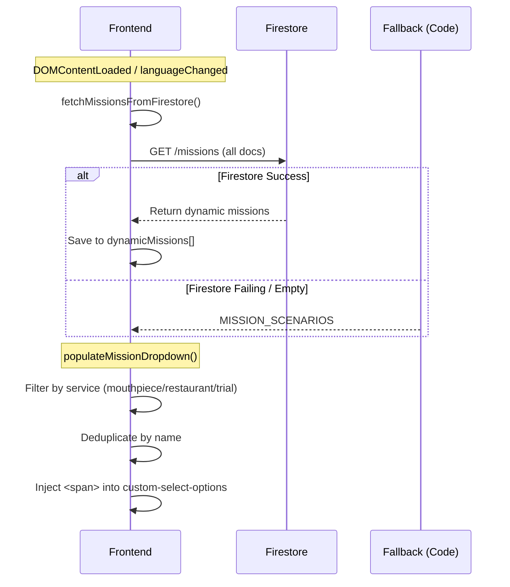

# Mission System Module

## Overview

The Mission System is responsible for managing the "Missions" (call scenarios) that users can select when initiating an AI call. These missions define the objective, persona, and initial script for the AI.

## Key Features

- 📑 **Dynamic Scenarios** - Fetched from Firestore to allow instant updates.
- 🌍 **Internationalization** - Missions support multi-language names and descriptions.
- 🛡️ **Fallback System** - Hardcoded missions ensure functionality even if the database is offline.
- 🎨 **Service Filtering** - Missions are tagged by service (mouthpiece, restaurant, trial).

## Mission Retrieval Flow

The frontend fetches available missions to populate the selection dropdowns.



## Data Structure

### MissionScenario Object

```typescript
interface MissionScenario {
    id: string;                      // Unique ID (e.g., 'restaurant_res')
    name: Record<string, string>;    // Localized names { en: '...', ja: '...' }
    description: Record<string, string>; // Localized descriptions
    services?: string[];             // ['restaurant', 'mouthpiece']
    google_type?: string;            // For place searching
    default_keyword?: string;        // Default search term
}
```

## Fallback Mechanism

If the Firestore collection `missions` is unreachable, the system uses the `MISSION_SCENARIOS` constant from `src/mission-scenarios.ts`.

---

**Related Files**:
- [`src/reservation.ts`](file:///Users/yi-hsuanlee/Desktop/yihsuanlee.github.io/src/reservation.ts)
- [`src/mouthpiece.ts`](file:///Users/yi-hsuanlee/Desktop/yihsuanlee.github.io/src/mouthpiece.ts)
- [`src/trial.ts`](file:///Users/yi-hsuanlee/Desktop/yihsuanlee.github.io/src/trial.ts)
- [`src/mission-scenarios.ts`](file:///Users/yi-hsuanlee/Desktop/yihsuanlee.github.io/src/mission-scenarios.ts)
