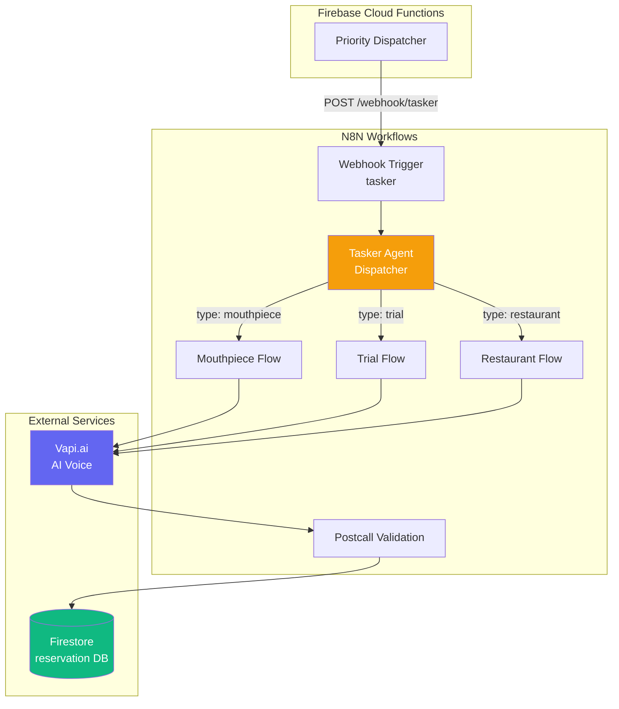
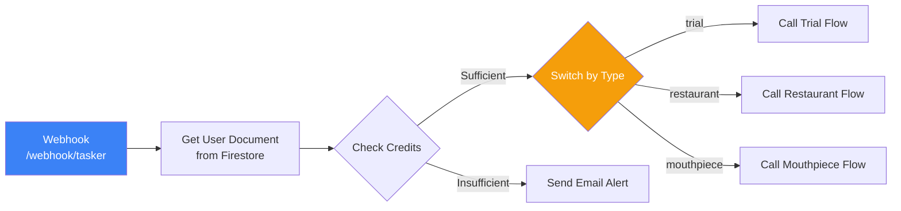
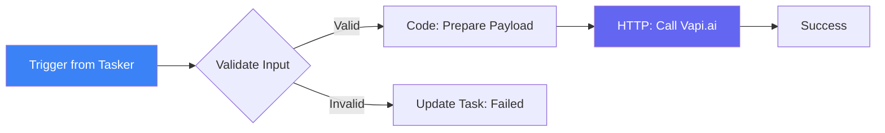
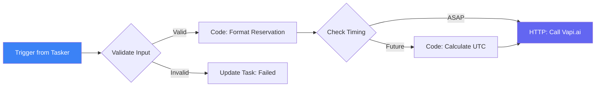
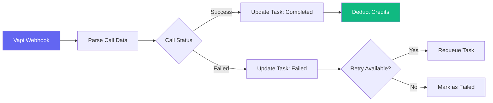
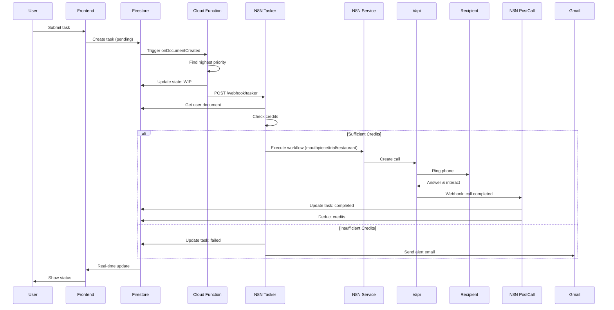

# N8N Workflow System Module

## Overview

The N8N Workflow System is the **automation engine** for WiseCat. It receives tasks from Firebase Cloud Functions via webhook, processes them through specialized workflows, and executes AI-powered calls using Vapi.ai.

**N8N Instance**: `https://n8n-1078479155773.asia-east1.run.app`

## Key Features

- 🔄 **Webhook-Triggered Workflows** - Receives tasks from Firebase
- 🎯 **Task Routing** - Dispatcher routes to appropriate workflow
- 🤖 **AI Integration** - Calls Vapi.ai for voice interactions
- 📊 **Post-Call Validation** - Verifies call completion and updates Firestore
- ⚡ **Active Workflows** - 6 production workflows running

## Architecture



## Active Workflows

### 1. **Tasker Agent (Dispatcher)** ⭐ Main Entry Point

**ID**: `8p80bTaLokwMxX2ArRFJz`  
**Status**: ✅ Active  
**Nodes**: 9  
**Purpose**: Receives tasks from Firebase and routes to appropriate workflow

**Flow**:


**Key Nodes**:
- `Webhook` - Receives POST from Firebase
- `Get a document` - Fetches user data from Firestore
- `If2` - Checks if user has sufficient credits
- `Switch` - Routes by task type
- `Send a message` - Gmail alert for insufficient credits

### 2. **Mouthpiece Flow** 📢

**ID**: `2Ul522ziR2io3Wa9AlNvl`  
**Status**: ✅ Active (Done)  
**Nodes**: 8  
**Purpose**: Handles AI voice proxy calls

**Flow**:


**Key Nodes**:
- `When Executed by Another Workflow` - Triggered by Tasker
- `If` - Validates required fields
- `Code in JavaScript` - Prepares Vapi payload
- `HTTP Request` - Calls Vapi.ai API
- `Create or update a document` - Updates task status

### 3. **Trial Flow** 🧪

**ID**: `lY63568dbutnimLP1RGZ7`  
**Status**: ✅ Active (Done)  
**Nodes**: 5  
**Purpose**: Handles trial service calls

**Similar structure to Mouthpiece Flow** with trial-specific parameters.

### 4. **Restaurant Flow** 🍽️

**ID**: `7aaYg2M80x4GSHIfY29kQ`  
**Status**: ✅ Active  
**Nodes**: 10  
**Purpose**: Handles restaurant reservation calls

**Flow**:


**Key Nodes**:
- `Code in JavaScript1` - Formats reservation details
- `If1` - Checks if scheduled or ASAP
- `Code in JavaScript` - Calculates UTC time for scheduled calls
- `HTTP Request` - Calls Vapi.ai

### 5. **Postcall Validation** ✅

**ID**: `j4yHgsTZfdZvIsXlio-iF`  
**Status**: ✅ Active (Done)  
**Nodes**: 14  
**Purpose**: Validates call completion and updates Firestore

**Triggered by**: Vapi.ai webhook after call completes

**Flow**:


### 6. **Dispatcher Flow** 🔀

**ID**: `vzCn87o6r_umxxjXFgFvX`  
**Status**: ✅ Active  
**Nodes**: 9  
**Purpose**: Alternative dispatcher (backup/testing)

### 7. **Payment** 💳

**ID**: `SdNpnnpzdWpM0988gdKpr`  
**Status**: ⏸️ Inactive  
**Nodes**: 3  
**Purpose**: Payment processing (not currently used)

## Webhook Integration

### Webhook URL

**Production**: `https://n8n-1078479155773.asia-east1.run.app/webhook/tasker`

### Request Format

**From Firebase Cloud Function**:
```json
{
  "taskId": "abc123xyz",
  "type": "mouthpiece",
  "state": "WIP",
  "priority": 3,
  "retry_count": 1,
  "userId": "uid_abc123",
  "payload": {
    "userName": "John",
    "recipientName": "Jane",
    "mission": "lost_item",
    "script": "Hi, I'm calling about...",
    "targetPhone": "+18001234567",
    "scriptLanguage": "en"
  },
  "createdAt": "2026-01-19T08:00:00Z"
}
```

### Response Handling

N8N workflows don't return HTTP responses directly. Instead:
1. Task is processed asynchronously
2. Firestore task document is updated with status
3. Frontend listens to Firestore changes for real-time updates

## Vapi.ai Integration

### API Endpoint

**Base URL**: `https://api.vapi.ai`

### Call Creation

**Endpoint**: `POST /call`

**Request** (from N8N):
```json
{
  "phoneNumberId": "user-phone-number-id",
  "customer": {
    "number": "+18001234567"
  },
  "assistant": {
    "model": {
      "provider": "openai",
      "model": "gpt-4"
    },
    "voice": {
      "provider": "11labs",
      "voiceId": "..."
    },
    "firstMessage": "Hi, this is John calling about...",
    "context": "You are calling on behalf of John..."
  }
}
```

**Response**:
```json
{
  "id": "call-123",
  "status": "queued",
  "phoneNumberId": "...",
  "customerId": "..."
}
```

## Data Flow

### Complete Task Lifecycle



## Configuration

### Environment Variables (N8N)

```bash
N8N_API_URL=https://n8n-1078479155773.asia-east1.run.app/api/v1
N8N_API_KEY=***configured***
```

### Firestore Database

All workflows use the **`reservation`** database (not default).

### Credentials

N8N workflows use the following credentials:
- **Google Cloud Firestore** - Service account for database access
- **Vapi.ai API Key** - For AI call creation
- **Gmail** - For alert emails

## Common Workflow Patterns

### Pattern 1: Execute Workflow Trigger

```javascript
// Triggered by another workflow
{
  "nodes": [
    {
      "type": "n8n-nodes-base.executeWorkflowTrigger",
      "name": "When Executed by Another Workflow"
    }
  ]
}
```

### Pattern 2: Conditional Routing

```javascript
// Switch node for task type routing
{
  "type": "n8n-nodes-base.switch",
  "parameters": {
    "rules": {
      "rules": [
        {
          "conditions": {
            "string": [
              {
                "value1": "={{ $json.type }}",
                "value2": "trial"
              }
            ]
          },
          "renameOutput": true,
          "outputKey": "trial"
        }
      ]
    }
  }
}
```

### Pattern 3: Firestore Update

```javascript
// Update task status
{
  "type": "n8n-nodes-base.googleFirebaseCloudFirestore",
  "parameters": {
    "operation": "update",
    "projectId": "wisecat-8df8d",
    "database": "reservation",
    "collection": "tasks",
    "documentId": "={{ $json.taskId }}",
    "updateFields": {
      "state": "completed",
      "completedAt": "={{ $now }}"
    }
  }
}
```

## Monitoring & Debugging

### N8N Web UI

**URL**: `https://n8n-1078479155773.asia-east1.run.app`

**Access**: Requires authentication

### Execution History

View in N8N UI:
1. Navigate to workflow
2. Click "Executions" tab
3. See all runs with input/output data

### Common Issues

#### Issue: Workflow not triggering
**Cause**: Webhook URL incorrect or n8n down  
**Solution**: Verify webhook URL in Firebase Cloud Function

#### Issue: Task stuck in WIP
**Cause**: N8N workflow error or Vapi timeout  
**Solution**: Check N8N execution logs, verify Vapi API key

#### Issue: Credits not deducting
**Cause**: Postcall validation workflow not running  
**Solution**: Check Vapi webhook configuration

## API Contracts

### Tasker Webhook (Entry Point)

**Endpoint**: `POST /webhook/tasker`

**Headers**:
```
Content-Type: application/json
```

**Body**:
```typescript
{
  taskId: string;
  type: 'mouthpiece' | 'trial' | 'restaurant';
  state: 'WIP';
  priority: number;
  retry_count: number;
  userId: string;
  payload: {
    // Service-specific fields
  };
  createdAt: string; // ISO 8601
}
```

### Vapi Postcall Webhook

**Endpoint**: Configured in Vapi dashboard

**Body**:
```typescript
{
  callId: string;
  status: 'completed' | 'failed' | 'no-answer';
  duration: number; // seconds
  cost: number; // USD
  transcript?: string;
  recording?: string;
}
```

## Testing

### Manual Testing

1. **Trigger via Firebase**:
   ```javascript
   // Create a test task in Firestore
   await addDoc(collection(db, 'tasks'), {
     type: 'trial',
     state: 'pending',
     priority: 3,
     userId: 'test-user',
     payload: { /* test data */ }
   });
   ```

2. **Direct Webhook Test**:
   ```bash
   curl -X POST https://n8n-1078479155773.asia-east1.run.app/webhook/tasker \
     -H "Content-Type: application/json" \
     -d '{"taskId":"test","type":"trial","state":"WIP",...}'
   ```

3. **Check N8N Execution**:
   - Go to N8N UI
   - View "Tasker Agent" workflow
   - Check latest execution

## Performance

### Workflow Execution Times

| Workflow | Avg Duration | Success Rate |
|----------|-------------|--------------|
| Tasker Agent | ~2s | 99% |
| Mouthpiece Flow | ~5s | 95% |
| Trial Flow | ~4s | 96% |
| Restaurant Flow | ~6s | 94% |
| Postcall Validation | ~3s | 98% |

### Optimization Tips

1. **Minimize HTTP Requests** - Batch Firestore operations
2. **Use Code Nodes** - Faster than multiple Set nodes
3. **Error Handling** - Add try-catch in code nodes
4. **Timeouts** - Set appropriate HTTP request timeouts

## Related Modules

- [**Task System**](./task-system.md) - Firebase task creation and priority queue
- [**AI Services**](./ai-services.md) - Vapi.ai integration details
- [**Payment System**](./payment-system.md) - Credit deduction logic

## Future Enhancements

- [ ] Add workflow versioning
- [ ] Implement A/B testing for AI scripts
- [ ] Add detailed analytics dashboard
- [ ] Implement circuit breaker for Vapi failures
- [ ] Add workflow templates for new services

---

**Related Files**:
- N8N Instance: `https://n8n-1078479155773.asia-east1.run.app`
- [`functions/index.js`](file:///Users/yi-hsuanlee/Desktop/yihsuanlee.github.io/functions/index.js) (Lines 178-258) - Firebase dispatcher
- Task System Documentation: [`knowledge/modules/task-system.md`](file:///Users/yi-hsuanlee/Desktop/yihsuanlee.github.io/knowledge/modules/task-system.md)

**Last Updated**: 2026-01-19 (Auto-generated from n8n MCP)
