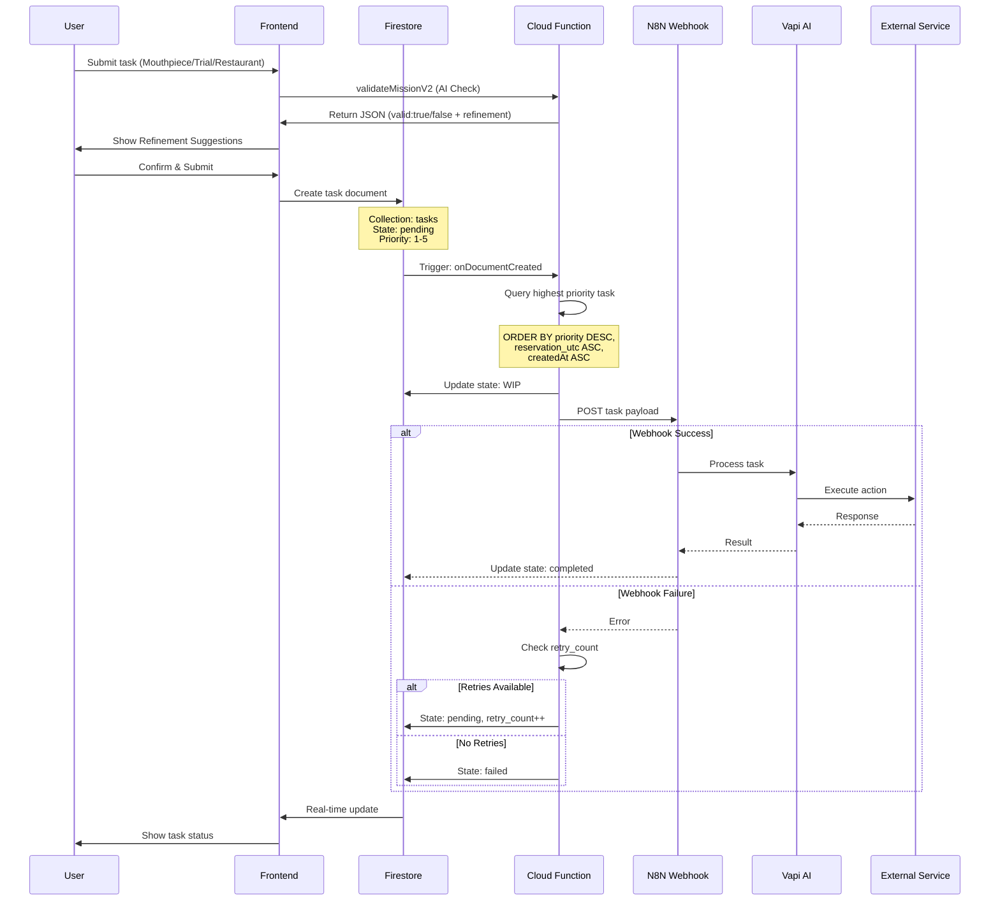
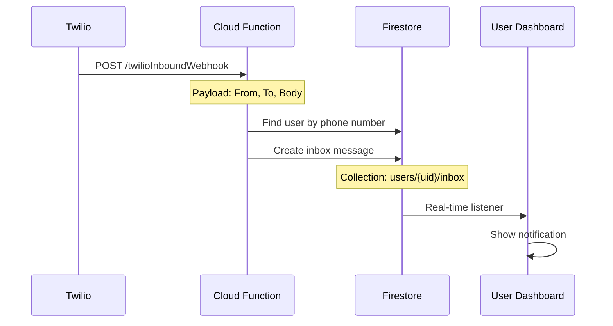

# Task System Module

## Overview

The Task System is the **core workflow engine** of WiseCat. It manages the lifecycle of all service requests (Mouthpiece, Trial, Restaurant) from creation to completion, including priority queuing, retry logic, and webhook dispatch to N8N for processing.

## Key Features

- 📋 **Task Queue Management** - Priority-based task processing
- 🔄 **Automatic Retry Logic** - Configurable retry attempts
- 🎯 **Priority Dispatcher** - Highest priority tasks processed first
- 🔗 **N8N Webhook Integration** - External task processing
- ⏰ **Scheduled Tasks** - Support for future execution
- 📊 **State Tracking** - Real-time task status updates

## Data Flow



## Components

### Frontend Files

#### Task Creation (Multiple Services)

**[`src/mouthpiece.ts`](file:///Users/yi-hsuanlee/Desktop/yihsuanlee.github.io/src/mouthpiece.ts)**
```typescript
// Creates Mouthpiece tasks
const taskData = {
  type: 'mouthpiece',
  state: 'pending',
  priority: 3,
  retry_count: 1, // Default for mouthpiece
  payload: {
    userName,
    recipientName,
    mission,
    script,
    targetPhone,
    scriptLanguage
  },
  createdAt: serverTimestamp()
};
await addDoc(collection(db, 'tasks'), taskData);
```

**[`src/trial.ts`](file:///Users/yi-hsuanlee/Desktop/yihsuanlee.github.io/src/trial.ts)**
```typescript
// Creates Trial tasks
const taskData = {
  type: 'trial',
  state: 'pending',
  priority: 2,
  retry_count: 1, // Default for trial
  // ...
};
```

**[`src/reservation.ts`](file:///Users/yi-hsuanlee/Desktop/yihsuanlee.github.io/src/reservation.ts)**
```typescript
// Creates Restaurant reservation tasks
const taskData = {
  type: 'restaurant',
  state: 'pending',
  priority: isRetryEnabled ? 5 : 1, // Conditional priority
  retry_count: isRetryEnabled ? 1 : 0, // Conditional retry
  reservation_utc: calculateUTC(date, time, timezone),
  // ...
};
```

### Backend (Cloud Functions)

#### [`functions/index.js`](file:///Users/yi-hsuanlee/Desktop/yihsuanlee.github.io/functions/index.js) - Priority Dispatcher

**Location**: Lines 178-258

```javascript
exports.triggerN8nWebhook = onDocumentCreated(
  {
    document: "tasks/{taskId}",
    database: "reservation",
  },
  async (event) => {
    const snapshot = event.data;
    const taskData = snapshot.data();
    
    // Only process pending tasks
    if (taskData.state !== 'pending') return;
    
    // Query for highest priority task
    const db = event.data.ref.firestore;
    const tasksRef = db.collection('tasks');
    const querySnapshot = await tasksRef
      .where('state', '==', 'pending')
      .orderBy('priority', 'desc')       // 5 → 1
      .orderBy('reservation_utc', 'asc') // Earliest first
      .orderBy('createdAt', 'asc')       // Tie-breaker
      .limit(1)
      .get();
    
    const winnerDoc = querySnapshot.docs[0];
    const winnerId = winnerDoc.id;
    
    // Lock the task
    await tasksRef.doc(winnerId).update({ state: 'WIP' });
    
    // Send to N8N
    const payload = { ...winnerData, taskId: winnerId };
    
    // Backfill retry_count if missing
    if (payload.retry_count === undefined) {
      payload.retry_count = (payload.type === 'restaurant') ? 0 : 1;
    }
    
    await axios.post(
      "https://n8n-1078479155773.asia-east1.run.app/webhook/tasker",
      payload
    );
  }
);
```

## Database Schema

### Collection: `tasks`

```typescript
interface Task {
  // Identification
  id: string;                    // Auto-generated document ID
  type: 'mouthpiece' | 'trial' | 'restaurant';
  userId: string;                // Owner UID
  
  // State Management
  state: 'pending' | 'WIP' | 'completed' | 'failed' | 'cancelled';
  priority: number;              // 1-5 (5 = highest)
  retry_count: number;           // Remaining retry attempts
  
  // Scheduling
  createdAt: Timestamp;          // Task creation time
  scheduled_at?: Timestamp;      // Future execution time (optional)
  reservation_utc?: Timestamp;   // For restaurant bookings
  
  // Payload (Service-specific)
  payload: {
    // Mouthpiece
    userName?: string;
    recipientName?: string;
    mission?: string;
    script?: string;
    targetPhone?: string;
    scriptLanguage?: string;
    
    // Trial
    trialType?: string;
    
    // Restaurant
    restaurantName?: string;
    restaurantPhone?: string;
    partySize?: number;
    date?: string;
    time?: string;
    note?: string;
    timezone?: string;
    
    // Common
    turnstileToken?: string;
  };
  
  // Results (populated after completion)
  result?: {
    status: string;
    message?: string;
    callId?: string;
    error?: string;
  };
  
  // Metadata
  updatedAt?: Timestamp;
  completedAt?: Timestamp;
}
```

### Firestore Indexes Required

**Critical**: These composite indexes are required for the priority query:

```json
{
  "indexes": [
    {
      "collectionGroup": "tasks",
      "queryScope": "COLLECTION",
      "fields": [
        { "fieldPath": "state", "order": "ASCENDING" },
        { "fieldPath": "priority", "order": "DESCENDING" },
        { "fieldPath": "reservation_utc", "order": "ASCENDING" },
        { "fieldPath": "createdAt", "order": "ASCENDING" }
      ]
    }
  ]
}
```

**File**: [`firestore.indexes.json`](file:///Users/yi-hsuanlee/Desktop/yihsuanlee.github.io/firestore.indexes.json)

## Priority System

### Priority Levels

| Priority | Use Case | Retry Count | Example |
|----------|----------|-------------|---------|
| 5 | Critical restaurant bookings with retry enabled | 1 | High-demand restaurant |
| 3 | Standard mouthpiece calls | 1 | Lost item inquiry |
| 2 | Trial service calls | 1 | Test call |
| 1 | Standard restaurant bookings without retry | 0 | Casual dining |

### Priority Logic

```javascript
// Restaurant reservation
const priority = isRetryCheckboxChecked ? 5 : 1;
const retry_count = isRetryCheckboxChecked ? 1 : 0;

// Mouthpiece/Trial (always retry once)
const priority = 3; // or 2 for trial
const retry_count = 1;
```

## Retry Logic

### How Retries Work

1. **Initial Attempt**: Task created with `retry_count` (0 or 1)
2. **Failure**: N8N webhook fails or returns error
3. **Retry Check**: Cloud Function checks `retry_count > 0`
4. **Requeue**: If retries available:
   - State: `pending`
   - `retry_count--`
   - Task re-enters queue
5. **Final Failure**: If `retry_count === 0`, state: `failed`

### Code Example

```javascript
// In Cloud Function error handler
catch (webhookError) {
  console.error(`Failed to send task ${winnerId} to N8N:`, webhookError.message);
  
  const currentRetries = winnerData.retry_count || 0;
  
  if (currentRetries > 0) {
    // Retry available - requeue
    await tasksRef.doc(winnerId).update({
      state: 'pending',
      retry_count: currentRetries - 1
    });
  } else {
    // No retries - mark as failed
    await tasksRef.doc(winnerId).update({
      state: 'failed',
      error: webhookError.message
    });
  }
}
```

## N8N Webhook Integration

### Webhook Endpoint

**Production URL**: `https://n8n-1078479155773.asia-east1.run.app/webhook/tasker`

### Request Format

```json
{
  "taskId": "abc123xyz",
  "type": "mouthpiece",
  "state": "WIP",
  "priority": 3,
  "retry_count": 1,
  "userId": "uid_abc123",
  "payload": {
    "userName": "John",
    "recipientName": "Jane",
    "mission": "lost_item",
    "script": "Hi, I'm calling about...",
    "targetPhone": "+18001234567",
    "scriptLanguage": "en"
  },
  "createdAt": "2026-01-19T08:00:00Z"
}
```

### Response Handling

N8N is responsible for:
1. Receiving task payload
2. Calling Vapi AI to execute the task
3. Updating Firestore task state:
   - `completed` - Success
   - `failed` - Error (triggers retry if available)

## SMS Webhook (Inbound Messages)

### Configuration

**Dynamic URL**: Stored in `configuration/settings` → `inboundSmsUrl`

**Default**: `https://us-central1-wisecat-8df8d.cloudfunctions.net/twilioInboundWebhook`

### How It Works



### Code Location

**File**: [`functions/index.js`](file:///Users/yi-hsuanlee/Desktop/yihsuanlee.github.io/functions/index.js) (search for `twilioInboundWebhook`)

**Configuration Update**:
```javascript
// Set SMS webhook URL when purchasing number
const purchasedNumber = await subaccountClient.incomingPhoneNumbers.create({
  phoneNumber: phoneNumber,
  smsUrl: smsUrl, // From configuration/settings
  smsMethod: 'POST'
});
```

## API Contracts

### Create Task (Frontend)

```typescript
import { collection, addDoc, serverTimestamp } from 'firebase/firestore';
import { db } from './firebase-config';

async function createTask(type: string, payload: object, priority: number = 3) {
  const taskData = {
    type,
    state: 'pending',
    priority,
    retry_count: type === 'restaurant' ? 0 : 1,
    userId: auth.currentUser!.uid,
    payload,
    createdAt: serverTimestamp()
  };
  
  const docRef = await addDoc(collection(db, 'tasks'), taskData);
  return docRef.id;
}
```

### Query User Tasks

```typescript
import { collection, query, where, orderBy, onSnapshot } from 'firebase/firestore';

function listenToUserTasks(userId: string, callback: Function) {
  const q = query(
    collection(db, 'tasks'),
    where('userId', '==', userId),
    orderBy('createdAt', 'desc')
  );
  
  return onSnapshot(q, (snapshot) => {
    const tasks = snapshot.docs.map(doc => ({
      id: doc.id,
      ...doc.data()
    }));
    callback(tasks);
  });
}
```

## Common Issues & Solutions

### Issue: Tasks stuck in "pending" state
**Cause**: Firestore index not created  
**Solution**: Deploy `firestore.indexes.json` or create index manually in Firebase Console

### Issue: Duplicate task processing
**Cause**: Multiple Cloud Function instances triggered  
**Solution**: State lock (`WIP`) prevents duplicates. Ensure query uses `limit(1)`

### Issue: Retry not working
**Cause**: `retry_count` not set correctly  
**Solution**: Backfill logic in Cloud Function handles missing values

### Issue: N8N webhook timeout
**Cause**: Network issues or N8N down  
**Solution**: Task reverts to `pending` and retries automatically

## Testing

### Manual Testing

1. **Create Task**:
   ```javascript
   // In browser console
   const task = await createTask('mouthpiece', {
     userName: 'Test',
     recipientName: 'Demo',
     mission: 'lost_item',
     script: 'Test script',
     targetPhone: '+18001234567',
     scriptLanguage: 'en'
   }, 3);
   console.log('Task ID:', task);
   ```

2. **Monitor Cloud Function Logs**:
   ```bash
   firebase functions:log --only triggerN8nWebhook
   ```

3. **Check Task State**:
   - Go to Firebase Console → Firestore → `tasks` collection
   - Find your task by ID
   - Verify state transitions: `pending` → `WIP` → `completed`

## Related Modules

- [**AI Services**](./ai-services.md) - Vapi integration for call execution
- [**User Management**](./user-management.md) - User credits and authentication
- [**Mouthpiece Service**](./mouthpiece-service.md) - Mouthpiece task creation
- [**Reservation Service**](./reservation-service.md) - Restaurant task creation
- [**Mission System**](./mission-system.md) - Scenario retrieval logic
- [**Payment System**](./payment-system.md) - Credit deduction for tasks

## Performance Considerations

### Query Optimization

- **Composite Index**: Required for priority query (3 fields)
- **Limit 1**: Only fetch the highest priority task
- **State Lock**: Prevents race conditions with `WIP` state

### Scalability

- **Concurrent Tasks**: Multiple tasks can be in `WIP` state
- **N8N Bottleneck**: N8N webhook is the limiting factor
- **Retry Backoff**: Consider adding exponential backoff for retries (future enhancement)

---

**Related Files**:
- [`functions/index.js`](file:///Users/yi-hsuanlee/Desktop/yihsuanlee.github.io/functions/index.js) (Lines 178-258)
- [`src/mouthpiece.ts`](file:///Users/yi-hsuanlee/Desktop/yihsuanlee.github.io/src/mouthpiece.ts)
- [`src/trial.ts`](file:///Users/yi-hsuanlee/Desktop/yihsuanlee.github.io/src/trial.ts)
- [`src/reservation.ts`](file:///Users/yi-hsuanlee/Desktop/yihsuanlee.github.io/src/reservation.ts)
- [`firestore.indexes.json`](file:///Users/yi-hsuanlee/Desktop/yihsuanlee.github.io/firestore.indexes.json)
