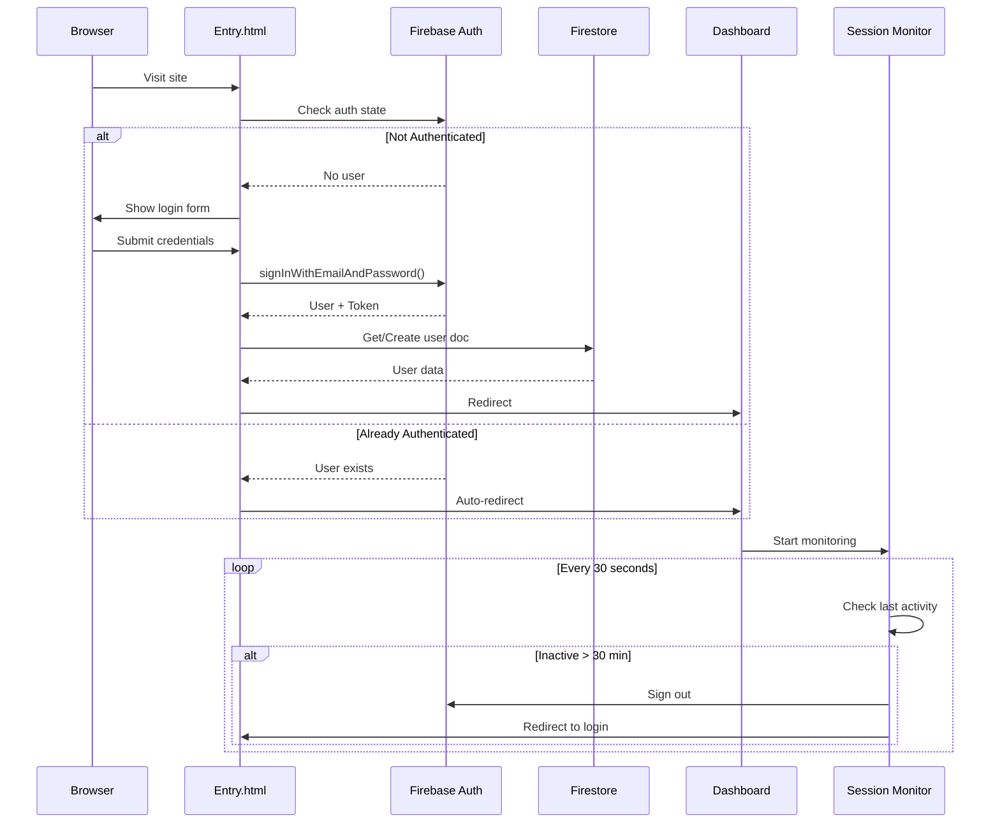

# User Management Module

## Overview

The User Management module handles authentication, user profiles, session management, and credit tracking. It uses Firebase Authentication for identity management and Firestore for user data persistence.

## Key Features

- 🔐 Email/Password authentication
- 👤 User profile management
- 💰 Credit balance tracking
- ⏱️ Session timeout (30 minutes inactivity)
- 🔄 Auto-redirect based on auth state

## Data Flow



## Components

### Frontend Files

#### [`src/entry.ts`](file:///Users/yi-hsuanlee/Desktop/yihsuanlee.github.io/src/entry.ts)
- **Purpose**: Login page logic
- **Key Functions**:
  - `handleLogin()` - Process login form submission
  - `onAuthStateChanged()` - Monitor auth state changes
  - Auto-redirect to dashboard if already logged in

#### [`src/session-timeout.ts`](file:///Users/yi-hsuanlee/Desktop/yihsuanlee.github.io/src/session-timeout.ts)
- **Purpose**: Session inactivity monitoring
- **Key Functions**:
  - `startSessionMonitor()` - Initialize session tracking
  - `updateLastActivity()` - Record user interactions
  - `checkInactivity()` - Verify session validity every 30s
- **Timeout**: 30 minutes of inactivity

#### [`src/firebase-config.ts`](file:///Users/yi-hsuanlee/Desktop/yihsuanlee.github.io/src/firebase-config.ts)
- **Purpose**: Firebase initialization
- **Exports**:
  - `auth` - Firebase Auth instance
  - `db` - Firestore instance (named database: "reservation")
  - `remoteConfig` - Remote Config instance

### Backend (Cloud Functions)

No dedicated Cloud Functions for user management. User creation/updates handled by Firestore security rules.

## Database Schema

### Collection: `users`

```typescript
interface User {
  uid: string;              // Firebase Auth UID (document ID)
  email: string;            // User email
  displayName?: string;     // Optional display name
  credits: number;          // Available credits (USD)
  createdAt: Timestamp;     // Account creation time
  lastActive: Timestamp;    // Last activity timestamp
  photoURL?: string;        // Profile picture URL (optional)
}
```

### Firestore Security Rules

```javascript
match /users/{userId} {
  // Users can only read/write their own document
  allow read, write: if request.auth != null && request.auth.uid == userId;
  
  // Prevent credit manipulation (only Cloud Functions can modify)
  allow update: if request.auth != null 
    && request.auth.uid == userId
    && !request.resource.data.diff(resource.data).affectedKeys().hasAny(['credits']);
}
```

## API Contracts

### Login Request
```typescript
// Client-side call
import { signInWithEmailAndPassword } from 'firebase/auth';
import { auth } from './firebase-config';

const result = await signInWithEmailAndPassword(auth, email, password);
// Returns: UserCredential
```

### Get User Data
```typescript
import { doc, getDoc } from 'firebase/firestore';
import { db, auth } from './firebase-config';

const userDoc = await getDoc(doc(db, 'users', auth.currentUser.uid));
const userData = userDoc.data();
// Returns: User object
```

## Code Examples

### Check if User is Logged In

```typescript
import { onAuthStateChanged } from 'firebase/auth';
import { auth } from './firebase-config';

onAuthStateChanged(auth, (user) => {
  if (user) {
    console.log('User logged in:', user.uid);
    // Redirect to dashboard
    window.location.href = '/dashboard.html';
  } else {
    console.log('User not logged in');
    // Show login form
  }
});
```

### Get Current User Credits

```typescript
import { doc, getDoc } from 'firebase/firestore';
import { db, auth } from './firebase-config';

async function getUserCredits(): Promise<number> {
  const userDoc = await getDoc(doc(db, 'users', auth.currentUser!.uid));
  return userDoc.data()?.credits || 0;
}
```

### Update Last Activity

```typescript
import { doc, updateDoc, serverTimestamp } from 'firebase/firestore';
import { db, auth } from './firebase-config';

async function updateActivity() {
  await updateDoc(doc(db, 'users', auth.currentUser!.uid), {
    lastActive: serverTimestamp()
  });
}
```

## Session Management

### Inactivity Detection

The session monitor tracks user activity through:
- Mouse movements
- Keyboard input
- Touch events
- Scroll events

**Implementation**:
```typescript
// src/session-timeout.ts
const INACTIVITY_TIMEOUT = 30 * 60 * 1000; // 30 minutes

function startSessionMonitor() {
  // Update activity on user interaction
  ['mousedown', 'keydown', 'scroll', 'touchstart'].forEach(event => {
    document.addEventListener(event, updateLastActivity);
  });
  
  // Check every 30 seconds
  setInterval(checkInactivity, 30000);
}
```

## Related Modules

- [**Payment System**](./payment-system.md) - Credit management and transactions
- [**Task System**](./task-system.md) - User tasks and history
- [**Frontend Components**](./frontend-components.md) - User profile UI
- [**Security & Validation**](./security-validation.md) - Auth security rules

## Common Issues & Solutions

### Issue: User redirected to login after refresh
**Cause**: Firebase Auth state not persisted  
**Solution**: Check Firebase Auth persistence setting in `firebase-config.ts`

### Issue: Session timeout not working
**Cause**: Event listeners not attached  
**Solution**: Ensure `startSessionMonitor()` is called on page load

### Issue: Credits not updating in UI
**Cause**: Firestore listener not set up  
**Solution**: Use `onSnapshot()` for real-time updates

## Testing

### Manual Testing
1. Visit `/Entry.html`
2. Login with test credentials
3. Verify redirect to dashboard
4. Wait 30 minutes without interaction
5. Verify auto-logout

### Test Accounts
See project admin for test credentials.

---

**Related Files**:
- [`Entry.html`](file:///Users/yi-hsuanlee/Desktop/yihsuanlee.github.io/Entry.html)
- [`src/entry.ts`](file:///Users/yi-hsuanlee/Desktop/yihsuanlee.github.io/src/entry.ts)
- [`src/session-timeout.ts`](file:///Users/yi-hsuanlee/Desktop/yihsuanlee.github.io/src/session-timeout.ts)
- [`src/firebase-config.ts`](file:///Users/yi-hsuanlee/Desktop/yihsuanlee.github.io/src/firebase-config.ts)
