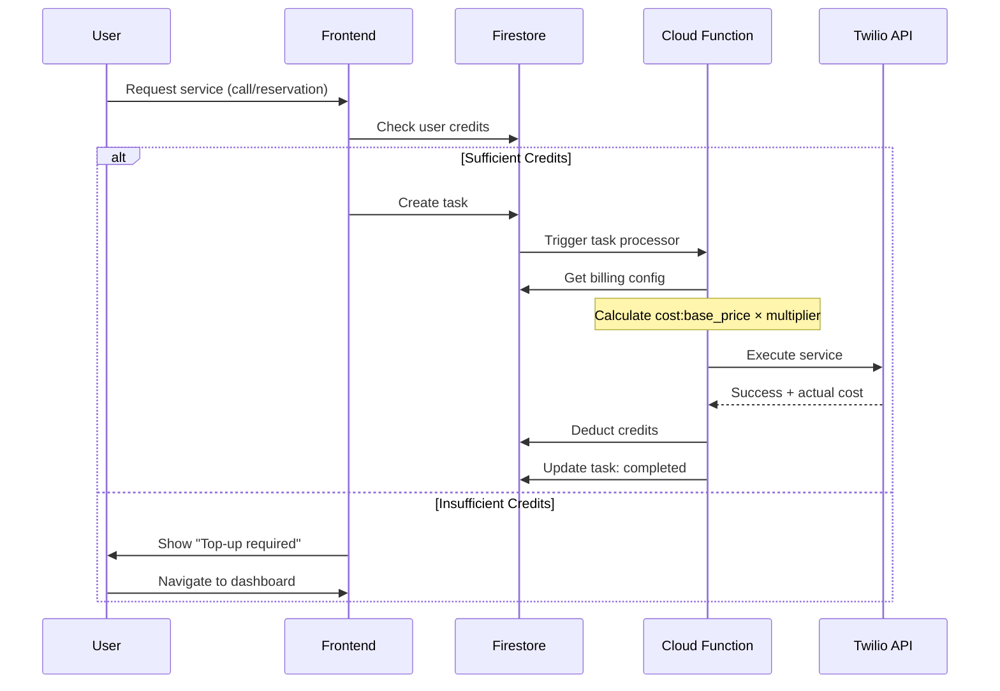
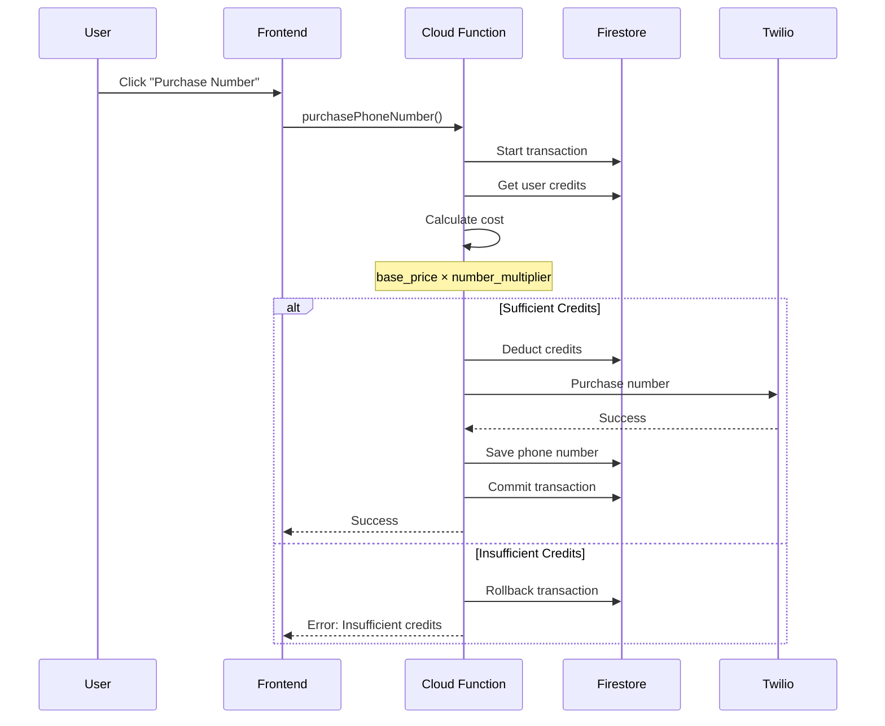
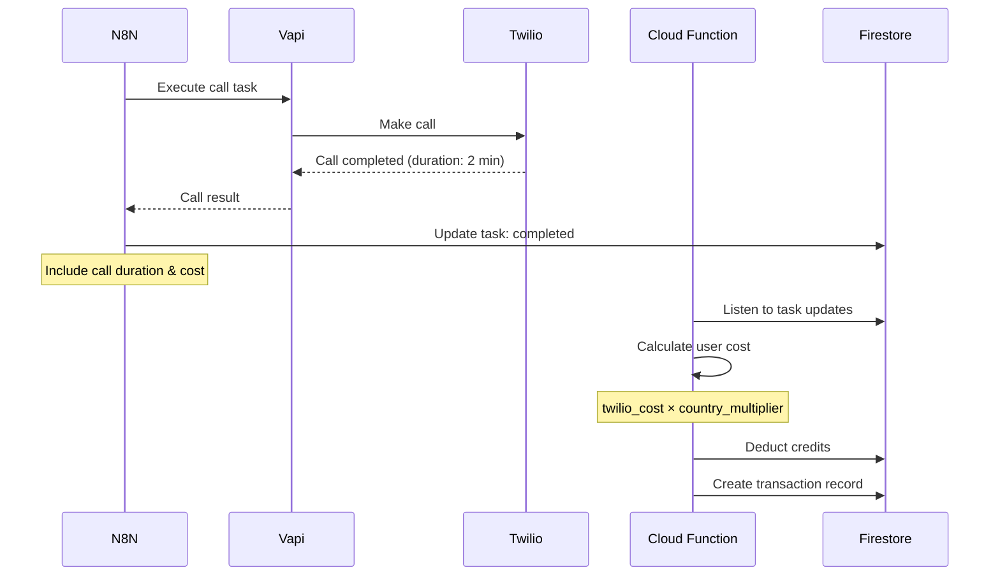

# Payment System Module

## Overview

The Payment System manages user credits, transactions, billing configuration, and cost calculations for all WiseCat services. It uses a **dynamic multiplier system** to calculate user-facing prices from base Twilio costs.

## Key Features

- 💰 **Credit Management** - User balance tracking in USD
- 🔢 **Dynamic Pricing** - Configurable multipliers per service/country
- 📊 **Usage Tracking** - Twilio usage history with markup
- 💳 **Transaction History** - Credit card records and top-ups
- 🌍 **Country-Specific Pricing** - Custom rates per region

## Data Flow



## Components

### Frontend Files

#### Credit Display

**All service pages** display current credits:
```typescript
// src/mouthpiece.ts, src/trial.ts, src/reservation.ts
async function updateCreditsDisplay() {
  const userDoc = await getDoc(doc(db, 'users', auth.currentUser!.uid));
  const credits = userDoc.data()?.credits || 0;
  
  const creditsElement = document.getElementById('formCredits');
  creditsElement.textContent = `Current Credits: $${credits.toFixed(2)} USD`;
}
```

#### Top-up Button

**Location**: All service pages
```html

  
    Current Credits: $0 USD
  
  💳 Top-up

```

### Backend (Cloud Functions)

#### Billing Configuration

**File**: [`functions/index.js`](file:///Users/yi-hsuanlee/Desktop/yihsuanlee.github.io/functions/index.js)

```javascript
async function getBillingConfig(db) {
  const settings = await db.doc("configuration/settings").get();
  const data = settings.data() || {};
  
  return data.billing || {
    number_multiplier: 2.0,      // Phone number purchase markup
    common_multiplier: 3.0,      // Default call rate markup
    services: {
      mouthpiece: 4.0,           // Mouthpiece service markup
      restaurant: 4.0            // Restaurant service markup
    },
    country_multipliers: {
      US: 3.0,
      JP: 3.5,
      TW: 3.2
      // ... more countries
    }
  };
}
```

### Database Schema

### Collection: `users/{uid}`

```typescript
interface User {
  uid: string;
  email: string;
  credits: number;              // Current balance in USD
  createdAt: Timestamp;
  lastActive: Timestamp;
}
```

### Collection: `users/{uid}/creditcard`

```typescript
interface CreditCard {
  id: string;                   // Auto-generated
  userId: string;               // Owner UID
  last4: string;                // Last 4 digits
  brand: string;                // 'visa', 'mastercard', etc.
  amount: number;               // Top-up amount
  createdAt: Timestamp;
  status: 'pending' | 'completed' | 'failed';
}
```

### Document: `configuration/settings`

```typescript
interface BillingConfig {
  billing: {
    number_multiplier: number;           // Phone purchase markup
    common_multiplier: number;           // Default call markup
    services: {
      mouthpiece: number;                // Service-specific markup
      restaurant: number;
      trial: number;
    };
    country_multipliers: {
      [countryCode: string]: number;     // Country-specific markup
    };
  };
}
```

## API Contracts

### Get Call Rates

**Cloud Function**: `getCallRates`

**Request**:
```typescript
const result = await httpsCallable(functions, 'getCallRates')({
  country: 'US'
});
```

**Response**:
```typescript
{
  country: 'US',
  currency: 'USD',
  multiplier: 3.0,
  outbound: [
    {
      prefix: '+1',
      base_price: 0.013,
      user_price: 0.039,      // base_price × multiplier
      friendly_name: 'United States'
    }
  ],
  inbound: [
    {
      type: 'local',
      base_price: 0.0085,
      user_price: 0.0255,
      description: 'Per minute cost to receive'
    }
  ]
}
```

### Get Usage History

**Cloud Function**: `getTransformedUsageHistory`

**Request**:
```typescript
const result = await httpsCallable(functions, 'getTransformedUsageHistory')({});
```

**Response**:
```typescript
{
  usage: [
    {
      category: 'calls',
      description: 'Outbound calls',
      usage: 15.5,              // minutes
      unit: 'minutes',
      base_price: 0.65,         // Twilio cost
      user_price: 1.95,         // base_price × multiplier
      currency: 'USD',
      start_date: '2026-01-18T00:00:00Z',
      end_date: '2026-01-19T00:00:00Z'
    },
    {
      category: 'sms',
      description: 'SMS messages',
      usage: 10,
      unit: 'messages',
      base_price: 0.08,
      user_price: 0.24,
      currency: 'USD',
      start_date: '2026-01-18T00:00:00Z',
      end_date: '2026-01-19T00:00:00Z'
    }
  ],
  multiplier: 3.0
}
```

## Credit Deduction Flow

### Phone Number Purchase



### Service Usage (Calls)



## Pricing Examples

### Phone Number Costs

| Country | Service Cost |
|---------|-----------|------------|------------|
| US Local | $1 |
| US Mobile | $1 |
| JP Local | $1 |
| TW Local | $1 |

### Call Rates (per minute)

| Destination | Base Rate | Multiplier | User Rate |
|------------|-----------|------------|-----------|
| US | $1 |
| Japan | $1 |
| Taiwan | $1 |
| UK | $1 |

### Service Costs

| Service | Base Cost | Multiplier | User Cost |
|---------|-----------|------------|-----------|
| Mouthpiece Call (2 min to US) | $1 |
| Restaurant Reservation (1 min to JP) | $1 |
| Trial Call (1 min to US) | $1 |

## Code Examples

### Check User Credits

```typescript
import { doc, getDoc } from 'firebase/firestore';
import { db, auth } from './firebase-config';

async function getUserCredits(): Promise {
  const userDoc = await getDoc(doc(db, 'users', auth.currentUser!.uid));
  return userDoc.data()?.credits || 0;
}

// Usage
const credits = await getUserCredits();
if (credits  {
  const userDoc = await transaction.get(userRef);
  const currentCredits = userDoc.data().credits || 0;
  
  const cost = 2.50; // Calculated cost
  
  if (currentCredits < cost) {
    throw new Error('Insufficient credits');
  }
  
  const newBalance = currentCredits - cost;
  transaction.update(userRef, { credits: newBalance });
  
  console.log(`Deducted $${cost}. New balance: $${newBalance}`);
});
```

### Update Billing Config

```javascript
// Update in Firebase Console or via script
const settingsRef = db.doc('configuration/settings');

await settingsRef.set({
  billing: {
    number_multiplier: 2.0,
    common_multiplier: 3.0,
    services: {
      mouthpiece: 4.0,
      restaurant: 4.0,
      trial: 3.5
    },
    country_multipliers: {
      US: 3.0,
      JP: 3.5,
      TW: 3.2,
      UK: 3.0,
      FR: 3.0
    }
  }
}, { merge: true });
```

## Common Issues & Solutions

### Issue: Credits not deducting
**Cause**: Transaction not committed or error in calculation  
**Solution**: Check Cloud Function logs for transaction errors

### Issue: Incorrect pricing displayed
**Cause**: Billing config not loaded or cached  
**Solution**: Verify `configuration/settings` document exists and has `billing` field

### Issue: Negative credits
**Cause**: Race condition in concurrent transactions  
**Solution**: Use Firestore transactions for all credit operations

### Issue: Usage history empty
**Cause**: Twilio subaccount has no activity or API error  
**Solution**: Check if user has made any calls, verify subaccount credentials

## Testing

### Manual Testing

1. **Check Credits**:
   ```javascript
   // In browser console
   const credits = await getUserCredits();
   console.log('Current credits:', credits);
   ```

2. **Simulate Purchase**:
   - Go to dashboard → Add Number
   - Search for a number
   - Note the price displayed
   - Verify it matches: `base_price × number_multiplier`

3. **Check Usage**:
   - Make a test call
   - Wait 5 minutes for Twilio to update
   - Check dashboard → Profile → Usage History
   - Verify markup is applied

## Related Modules

- [**User Management**](./user-management.md) - User credit balance storage
- [**Task System**](./task-system.md) - Service cost deduction
- [**Phone Numbers**](./phone-numbers.md) - Number purchase costs
- [**AI Services**](./ai-services.md) - Call cost calculation

## Performance Considerations

### Caching

- **Billing Config**: Cache in memory for 5 minutes
- **User Credits**: Real-time (no cache) to prevent overdraft
- **Usage History**: Cache for 1 hour (Twilio updates slowly)

### Transaction Safety

- Always use Firestore transactions for credit operations
- Implement retry logic for failed transactions
- Log all credit changes for audit trail

---

**Related Files**:
- [`functions/index.js`](file:///Users/yi-hsuanlee/Desktop/yihsuanlee.github.io/functions/index.js) (Lines 367-537)
- [`src/mouthpiece.ts`](file:///Users/yi-hsuanlee/Desktop/yihsuanlee.github.io/src/mouthpiece.ts)
- [`src/trial.ts`](file:///Users/yi-hsuanlee/Desktop/yihsuanlee.github.io/src/trial.ts)
- [`src/reservation.ts`](file:///Users/yi-hsuanlee/Desktop/yihsuanlee.github.io/src/reservation.ts)
